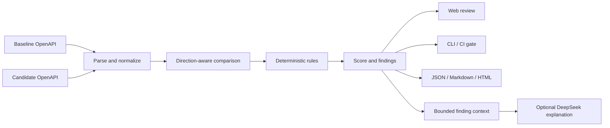

# ContractGuard

English | [简体中文](README.md)

**A local-first, explainable OpenAPI compatibility analyzer for human review and CI quality gates.**

ContractGuard compares a baseline OpenAPI contract with a candidate version and identifies changes that may break existing consumers. Every deterministic finding has a stable rule ID, severity, and exact contract location. An optional DeepSeek integration can turn those findings into a risk summary, migration plan, and test suggestions without participating in compatibility decisions.

ContractGuard targets the OpenAPI 3.0 and 3.1 series. Refer to the official [OpenAPI 3.0.4 specification](https://spec.openapis.org/oas/v3.0.4.html), [OpenAPI 3.1.2 specification](https://spec.openapis.org/oas/v3.1.2.html), and [published version index](https://spec.openapis.org/oas/).

## The problem

Two OpenAPI documents can both be valid while the newer contract still breaks existing clients. Common examples include:

- making an optional query parameter required;
- removing a response property that an older client reads;
- narrowing accepted request enum values;
- adding a response enum value that an exhaustive client cannot handle;
- replacing a success status code expected by an SDK.

A schema validator answers whether one document is valid. A text diff shows changed lines. ContractGuard answers a different question: **what existing usage may break after this API version is released, why, and where should the team focus migration and testing work?**

## Features

| Capability | Description |
| --- | --- |
| Deterministic rule engine | Compares paths, operations, parameters, bodies, responses, schemas, media types, and security requirements |
| Direction-aware analysis | Applies different compatibility reasoning to request and response positions |
| Explainable findings | Returns a stable rule ID, severity, contract location, evidence, and remediation guidance |
| Web workspace | Imports or pastes two specifications, filters findings, opens history, and exports reports |
| CLI and CI gate | Uses stable exit codes and configurable severity thresholds |
| REST API | Creates and retrieves analyses, lists rules, and exports JSON, Markdown, or HTML |
| Optional DeepSeek review | Produces an audience-friendly explanation from bounded deterministic findings |
| Local-first core | Requires neither a cloud account nor a database; AI is disabled by default |

## Architecture



The model cannot change finding severity, compatibility score, the `compatible` flag, or CI exit codes. Core analysis remains available when the model is disabled or unavailable.

## Quick start

Requirements:

- Node.js 22.13 or newer;
- pnpm 11.

```bash
corepack enable
pnpm install --frozen-lockfile
pnpm build
pnpm start
```

Open `http://localhost:8080`.

If Corepack is unavailable, install the pinned package manager with:

```bash
npm install --global pnpm@11.19.0
```

On Windows, use `pnpm.cmd` if PowerShell blocks `pnpm.ps1`:

```powershell
pnpm.cmd install --frozen-lockfile
pnpm.cmd build
.\start-contractguard.bat
```

The launcher accepts an optional DeepSeek API key. Press Enter at the prompt to run only the local deterministic analyzer.

## Try the bundled fixture

```bash
pnpm demo
```

Or invoke the CLI directly:

```bash
pnpm contractguard compare \
  fixtures/petstore-v1.yaml \
  fixtures/petstore-v2-breaking.yaml \
  --format markdown \
  --output contractguard-report.md \
  --fail-on breaking
```

Exit codes are `0` for success below the selected threshold, `1` for input or execution errors, and `2` when findings reach the selected failure threshold.

## Optional DeepSeek integration

```dotenv
CONTRACTGUARD_AI_ENABLED=true
DEEPSEEK_API_KEY=<YOUR_DEEPSEEK_API_KEY>
DEEPSEEK_BASE_URL=https://api.deepseek.com
DEEPSEEK_MODEL=deepseek-flash
```

The API key remains server-side. ContractGuard sends bounded finding context rather than the original OpenAPI documents, validates the model response at runtime, and keeps generated prose outside the deterministic decision path. See [the AI report interpreter guide](docs/ai-report-interpreter.md) for PowerShell, bash, Docker, and API examples.

Using a cloud model may incur fees and may expose internal endpoint names contained in findings. Review your organization's data policy first.

## Docker

```bash
docker compose up --build
```

Open `http://localhost:8080`. Compose binds to `127.0.0.1` by default and stores history in a Docker volume. The application does not include authentication; do not expose it directly to the public Internet.

## Repository layout

```text
apps/
  api/       REST API, report export, local persistence, DeepSeek adapter
  cli/       command-line and CI entry point
  web/       Vue 3 workspace
packages/
  core/      OpenAPI parsing, reference resolution, rules, and scoring
fixtures/    reproducible compatible and breaking examples
examples/    GitHub Actions and AI request examples
docs/        architecture, rules, API, usage, development, and evaluation
scripts/     end-to-end smoke test
```

## Deliverables

| Deliverable | Location | Purpose |
| --- | --- | --- |
| Core rule engine | `packages/core/` | OpenAPI parsing, local `$ref`, direction-aware rules, and scoring |
| REST API | `apps/api/` | Analyses, history, report export, local persistence, and DeepSeek adapter |
| CLI / CI | `apps/cli/` | File comparison, output formatting, and threshold exit codes |
| Web workspace | `apps/web/` | Dual-spec input, filtering, history, and AI explanations |
| Fixtures and examples | `fixtures/`, `examples/` | Compatible/breaking cases, evaluation manifest, and integrations |
| Documentation | `docs/`, `README*.md` | Usage, architecture, rules, API, AI, evaluation, and verification |
| Deployment | `Dockerfile`, `docker-compose.yml`, `start-contractguard.bat` | Docker and Windows startup paths |
| Automated verification | `.github/workflows/ci.yml`, `scripts/smoke-test.mjs` | Build, type checks, unit tests, and smoke tests |
| Governance | `LICENSE`, `SECURITY.md`, `.env.example` | License, security boundaries, and configuration template |

See the [delivery checklist](docs/delivery-checklist.md) for detailed status and publication boundaries. The repository excludes dependencies, build output, runtime history, real API keys, and machine-specific sensitive data.

## Verification

```bash
pnpm build
pnpm typecheck
pnpm test
node scripts/smoke-test.mjs
```

The included GitHub Actions workflow installs the locked dependency graph on Node.js 22, builds and tests the monorepo, and verifies that the breaking fixture triggers the expected CI policy.

## Documentation

- [Project overview and real-world scenarios](docs/project-overview.md)
- [User guide](docs/user-guide.md)
- [Architecture](docs/architecture.md)
- [Compatibility rules](docs/compatibility-rules.md)
- [REST API](docs/api-reference.md)
- [DeepSeek report interpreter](docs/ai-report-interpreter.md)
- [Development guide](docs/development.md)
- [Evaluation methodology](docs/evaluation.md)
- [Verification record](docs/verification.md)
- [Delivery checklist](docs/delivery-checklist.md)

## Current scope

ContractGuard targets OpenAPI 3.0/3.1 and local JSON Pointer `$ref` values. Swagger 2.0, external or cross-file references, general composition reasoning, business behavior, database migrations, and runtime traffic compatibility remain outside the current deterministic scope. It complements rather than replaces consumer contract tests, integration tests, canary releases, and human review.

## License

[MIT](LICENSE)
