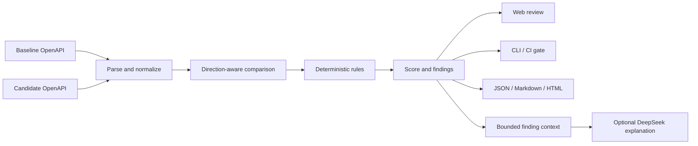

# ContractGuard

[English](README.en.md) | 简体中文

**本地优先、可解释、可接入 CI 的 OpenAPI 兼容性分析平台。**

ContractGuard compares a baseline OpenAPI contract with a candidate version, detects changes that may break existing consumers, and explains every finding with a stable rule ID and an exact contract location. A deterministic engine is responsible for all compatibility decisions; an optional DeepSeek integration can turn those results into migration and testing guidance.

ContractGuard 当前面向 OpenAPI 3.0 和 3.1 系列。规范原文可参阅 [OpenAPI 3.0.4](https://spec.openapis.org/oas/v3.0.4.html)、[OpenAPI 3.1.2](https://spec.openapis.org/oas/v3.1.2.html)以及 [OpenAPI 官方版本索引](https://spec.openapis.org/oas/)。

## 它解决什么问题

两份 OpenAPI 文档都可能完全合法，新版本仍然会破坏旧客户端。例如：

- 把可选查询参数改为必填后，旧版 App 开始收到 `400`；
- 删除响应字段后，仍在读取该字段的前端出现运行时错误；
- 收窄请求枚举后，过去合法的输入不再被接受；
- 新增响应枚举值后，使用穷举分支的旧 SDK 无法处理；
- 修改成功状态码后，客户端把正常结果当成异常。

普通 OpenAPI 校验器只能判断规范是否有效，Git diff 只能展示文本变化，服务端测试通常只覆盖当前实现。ContractGuard 回答的是更接近发布决策的问题：**这次 API 升级可能破坏哪些既有调用方式，风险在哪里，应该怎样迁移和验证？**

## 核心能力

| 能力 | 说明 |
| --- | --- |
| 确定性规则引擎 | 比较路径、操作、参数、请求体、响应、Schema、媒体类型和鉴权变化 |
| 方向感知判断 | 区分请求与响应的兼容方向，避免把所有结构差异等同处理 |
| 可解释结果 | 输出稳定规则编号、严重等级、规范位置、前后证据和修复建议 |
| Web 工作台 | 导入或粘贴两份规范，筛选结果、查看历史并导出报告 |
| CLI 与 CI 门禁 | 根据风险阈值返回稳定退出码，可用于 pull request 检查 |
| REST API | 创建、查询和删除分析，读取规则目录，导出 JSON、Markdown、HTML |
| 可选 DeepSeek 解读 | 根据已有 finding 生成风险摘要、迁移步骤与测试建议 |
| 本地优先 | 核心分析无需云服务或数据库；AI 默认关闭 |

## 工作方式



DeepSeek 不参与严重等级、兼容性得分或 CI 退出码的计算。即使模型不可用，核心分析仍可完整运行。

## 快速开始

### 环境要求

- Node.js 22.13 或更高版本；
- pnpm 11（版本已在 `packageManager` 字段和锁文件中固定）。

如果本机尚未启用 pnpm，可优先使用 Node 自带的 Corepack：

```bash
corepack enable
```

如果系统没有 Corepack，也可以运行：

```bash
npm install --global pnpm@11.19.0
```

### 安装并运行

```bash
pnpm install --frozen-lockfile
pnpm build
pnpm start
```

浏览器访问 `http://localhost:8080`。

开发模式使用：

```bash
pnpm dev
```

Web 开发服务器默认监听 `5173`，API 默认监听 `8080`。

### Windows

PowerShell 如果拦截 `pnpm.ps1`，直接使用带 `.cmd` 的命令：

```powershell
pnpm.cmd install --frozen-lockfile
pnpm.cmd build
.\start-contractguard.bat
```

启动脚本会安全读取可选的 DeepSeek API Key。直接按 Enter 可以关闭 AI 解读并只运行本地规则引擎；输入的 Key 只存在于当前进程，不会写入项目文件。

## 运行内置示例

项目包含一组兼容变更和一组破坏性变更：

```bash
pnpm demo
```

也可以直接调用 CLI：

```bash
pnpm contractguard compare \
  fixtures/petstore-v1.yaml \
  fixtures/petstore-v2-breaking.yaml \
  --format markdown \
  --output contractguard-report.md \
  --fail-on breaking
```

CLI 退出码：

- `0`：分析完成且没有达到失败阈值；
- `1`：输入、解析或执行错误；
- `2`：发现达到 `--fail-on` 阈值的变化。

可复制的 GitHub Actions 示例位于 [`examples/github-actions-contractguard.yml`](examples/github-actions-contractguard.yml)。

## 可选：启用 DeepSeek

AI 解读默认关闭，核心功能不需要 API Key。服务端使用以下环境变量：

```dotenv
CONTRACTGUARD_AI_ENABLED=true
DEEPSEEK_API_KEY=<YOUR_DEEPSEEK_API_KEY>
DEEPSEEK_BASE_URL=https://api.deepseek.com
DEEPSEEK_MODEL=deepseek-flash
CONTRACTGUARD_AI_TIMEOUT_MS=30000
CONTRACTGUARD_AI_MAX_CHANGES=50
CONTRACTGUARD_AI_MAX_OUTPUT_TOKENS=8192
```

安全边界：

- Key 只从服务端环境读取，不会返回给浏览器；
- 默认不向模型发送原始 OpenAPI，只发送有上限的规则结果和用户填写的关注点；
- 模型响应必须通过运行时结构校验；
- AI 输出不能覆盖规则等级、得分、兼容结论或 CI 状态。

PowerShell、bash、Docker 和接口调用示例见 [`docs/ai-report-interpreter.md`](docs/ai-report-interpreter.md)。使用云端模型可能产生费用，也可能暴露 finding 中包含的内部接口名称，请先评估组织的数据策略。

## Docker

```bash
docker compose up --build
```

访问 `http://localhost:8080`。分析历史保存在 Docker volume 中，Compose 默认只绑定 `127.0.0.1`。本项目没有提供身份认证；不要在未配置 TLS、鉴权、限流和预算保护的情况下直接暴露到公网。

## 工程结构

```text
apps/
  api/       REST API、报告导出、本地持久化、DeepSeek 适配器
  cli/       面向本地与 CI 的命令行工具
  web/       Vue 3 Web 工作台
packages/
  core/      OpenAPI 解析、引用解析、兼容性规则与评分
fixtures/    可复现的兼容/不兼容样例与期望清单
examples/    GitHub Actions 与 AI 请求示例
docs/        架构、规则、API、使用、开发和评估文档
scripts/     端到端冒烟测试
```

## 交付内容

| 内容 | 位置 | 用途 |
| --- | --- | --- |
| 核心规则引擎 | `packages/core/` | OpenAPI 解析、本地 `$ref`、方向感知规则和评分 |
| REST API | `apps/api/` | 分析记录、报告导出、本地持久化和 DeepSeek 适配器 |
| CLI / CI | `apps/cli/` | 文件比较、格式输出和阈值退出码 |
| Web 工作台 | `apps/web/` | 双规范输入、结果筛选、历史记录和 AI 解读 |
| 样例与评估 | `fixtures/`、`examples/` | 兼容/破坏性样例、评估清单和集成示例 |
| 项目文档 | `docs/`、`README*.md` | 使用、架构、规则、API、AI、评估和验证说明 |
| 部署与启动 | `Dockerfile`、`docker-compose.yml`、`start-contractguard.bat` | Docker 与 Windows 启动 |
| 自动化验证 | `.github/workflows/ci.yml`、`scripts/smoke-test.mjs` | 构建、类型检查、单元测试和冒烟测试 |
| 治理文件 | `LICENSE`、`SECURITY.md`、`.env.example` | 许可证、安全边界和配置模板 |

完整状态和发布边界见 [交付清单](docs/delivery-checklist.md)。仓库不包含依赖目录、构建产物、运行历史、真实 API Key 或其他本机敏感数据。

## 验证

```bash
pnpm build
pnpm typecheck
pnpm test
node scripts/smoke-test.mjs
```

GitHub Actions 会在 Node.js 22 上重新安装锁定依赖、执行构建和测试，并验证破坏性 fixture 能正确触发 CI 失败策略。

## 文档

- [项目介绍与实际使用场景](docs/project-overview.md)
- [用户指南](docs/user-guide.md)
- [系统架构](docs/architecture.md)
- [兼容性规则与判定方向](docs/compatibility-rules.md)
- [REST API](docs/api-reference.md)
- [DeepSeek AI 报告解释器](docs/ai-report-interpreter.md)
- [开发与扩展规则](docs/development.md)
- [评估方法与结果](docs/evaluation.md)
- [验证记录](docs/verification.md)
- [交付清单](docs/delivery-checklist.md)

## 当前边界

ContractGuard 当前面向 OpenAPI 3.0/3.1，并重点支持本地 JSON Pointer `$ref`。以下内容仍需要其他工具或人工评审：

- Swagger 2.0；
- 外部 URL 和跨文件引用；
- 一般化的 `oneOf`、`anyOf`、`allOf` 包含关系；
- 数据库迁移、业务副作用和运行时流量行为；
- 完整的消费者契约测试与灰度发布策略。

兼容性得分用于风险排序，不是生产安全的数学证明。详细覆盖范围见 [`docs/compatibility-rules.md`](docs/compatibility-rules.md)。

## License

[MIT](LICENSE)
