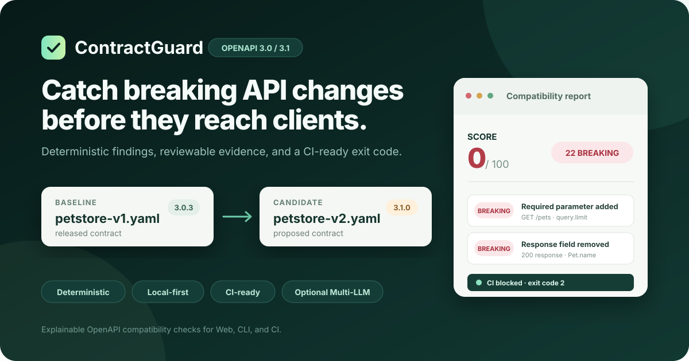

# ContractGuard — OpenAPI Breaking Change Detector

[简体中文](README.zh-CN.md) · English

[](https://github.com/mingxian233/ContractGuard/actions/workflows/ci.yml)
[](https://github.com/mingxian233/ContractGuard/releases)
[](LICENSE)
[](package.json)



**Find where existing API consumers may break—before the contract reaches production.** ContractGuard is a local-first, explainable OpenAPI compatibility analyzer for design review and CI quality gates.

ContractGuard compares a released OpenAPI contract (the baseline) with a proposed contract (the candidate) and identifies changes that may break existing consumers. It goes beyond showing what changed: each finding includes a severity, stable rule ID, precise contract location, relevant before/after evidence, and remediation guidance.

All compatibility decisions come from a deterministic rule engine. The optional multi-LLM interpreter can use server-configured DeepSeek, OpenAI, Gemini, or Ollama profiles to turn existing findings into a risk summary, migration plan, and test suggestions; it does not participate in scoring or release gating.

The current release targets OpenAPI 3.0 and 3.1. Refer to the official [OpenAPI 3.0.4 specification](https://spec.openapis.org/oas/v3.0.4.html), [OpenAPI 3.1.2 specification](https://spec.openapis.org/oas/v3.1.2.html), and [published specification index](https://spec.openapis.org/oas/) for the authoritative syntax.

**[View a real report](examples/reports/petstore-breaking.md) · [Run locally](#run-it-in-five-minutes) · [Add it to CI](#cli-and-ci-usage) · [Read the rule model](docs/compatibility-rules.md)**

Verified by the repository's automated test and end-to-end fixture suites. See the reproducible [verification record](docs/verification.md); fixture coverage is not presented as real-world accuracy.

## See the result

Run the bundled fixture after installation:

```bash
pnpm demo
```

```text
ContractGuard: petstore-v1.yaml -> petstore-v2-breaking.yaml
Score 0/100 | BREAKING CHANGES | breaking 22 | potential 8 | safe 1 | info 1
```

Every finding carries a stable rule ID, severity, exact OpenAPI location, before/after evidence, and remediation. Use the Web workspace for review, export JSON/Markdown/HTML, or return exit code `2` to block an incompatible pull request.

## Why it exists

Two OpenAPI documents can both be valid while the newer contract still breaks old clients. For example:

- making an optional query parameter required causes an old app to receive `400` responses;
- removing a response property breaks a frontend or SDK that still reads it;
- narrowing a request enum rejects input that used to be valid;
- widening a response enum surprises clients with exhaustive branches;
- changing a success status or adding authentication changes an established call flow.

A validator answers whether a document is syntactically valid. A text diff answers which lines changed. ContractGuard answers the release question: **where might existing consumers fail, why, and what should the team migrate or test first?**

## Where it fits

| Scenario | How ContractGuard helps |
| --- | --- |
| Pull request gate | Compare the released and proposed contracts in CI and return exit code `2` when findings reach the selected threshold |
| API design review | Inspect risk locations, evidence, and remediation in the Web workspace before implementation |
| SDK/client migration | Export Markdown or HTML and optionally generate a staged migration and regression-test checklist |
| Version audit and handoff | Feed JSON reports into automation and keep reviewable analysis history in local files |

ContractGuard is a static contract analyzer. It is not runtime monitoring, an API security scanner, or production traffic validation.

## Capabilities

| Capability | Current implementation |
| --- | --- |
| Deterministic rule engine | Checks paths, operations, parameters, request bodies, responses, media types, schemas, security, and selected metadata |
| Direction-aware analysis | Reasons separately about accepted requests and produced responses instead of classifying identical schema edits mechanically |
| Explainable findings | Returns a stable rule ID, severity, contract location, before/after evidence, and remediation guidance |
| Web workspace | Imports, drops, or pastes two YAML/JSON specifications; filters results, opens history, browses rules, and exports reports |
| CLI and CI gate | Supports `table`, `json`, `markdown`, and `html` output with configurable failure thresholds |
| REST API | Creates, reads, and deletes analyses; lists rules; exports JSON, Markdown, and HTML reports |
| Local persistence | Stores analysis records as local JSON files with no database requirement |
| Policy as code | Enables, suppresses, or reclassifies known rules and customizes score weights through validated JSON |
| Reproducible audit metadata | Records SHA-256 fingerprints for baseline, candidate, and the normalized rule policy |
| Optional multi-LLM review | Selects an enabled DeepSeek, OpenAI, Gemini, or Ollama profile and produces a structured review from bounded finding context |

## Run it in five minutes

### 1. Prerequisites

- Node.js 22.13 or newer;
- pnpm 11.19.0, pinned by the repository's `packageManager` field and lockfile.

Node.js 22 installations can normally enable pnpm through Corepack:

```bash
corepack enable
corepack prepare pnpm@11.19.0 --activate
```

If Corepack is not available:

```bash
npm install --global pnpm@11.19.0
```

### 2. Install, build, and start

```bash
git clone https://github.com/mingxian233/ContractGuard.git
cd ContractGuard
pnpm install --frozen-lockfile
pnpm build
pnpm start
```

Open `http://localhost:8080`, select “载入演示规范” (load demo contracts), and then select “运行兼容性分析” (run compatibility analysis). AI is disabled by default, so the first analysis requires no API key and makes no model request.

For development:

```bash
pnpm dev
```

The Web development server runs at `http://localhost:5173` and proxies `/api` to the API on local port `8080`.

### Windows launcher

The BAT entry point calls a PowerShell 5.1-compatible launcher with a temporary execution-policy bypass. On the first run, install the locked dependencies, build, and start with:

```powershell
.\start-contractguard.bat --install
```

Normal and maintenance modes:

```powershell
.\start-contractguard.bat
# Or start with a V1.1 profile file:
.\start-contractguard.bat --config .\config\llm-providers.local.json
# Rebuild after changing source files, then start:
.\start-contractguard.bat --build
# Run only the deterministic analyzer:
.\start-contractguard.bat --no-ai
# Validate runtime, builds, LLM JSON and rule policy without starting:
.\start-contractguard.bat --check --config .\config\llm-providers.local.json --policy .\config\rule-policy.example.json
```

With no argument, the launcher automatically uses `config\llm-providers.local.json` when it exists; otherwise it retains the legacy DeepSeek flow. It validates JSON with the server parser, rejects missing or stale builds, honors existing environment settings, and securely asks only for a missing key of an enabled active profile. Supplied keys exist only in the server process environment and are not written to a project file. The launcher deliberately does not load `.env`; inject secrets through the current process or a secret manager. Run `start-contractguard.bat --help` for all modes, including host/port overrides and non-pausing automation. If a custom Windows path contains CMD metacharacters such as `&`, set `CONTRACTGUARD_LLM_CONFIG`/`CONTRACTGUARD_POLICY_CONFIG` in PowerShell instead of passing that path through a BAT argument.

## CLI and CI usage

After building, run the bundled breaking-change example:

```bash
pnpm demo
```

To write a Markdown report and fail when a `breaking` finding is present:

```bash
pnpm contractguard compare fixtures/petstore-v1.yaml fixtures/petstore-v2-breaking.yaml --format markdown --output contractguard-report.md --fail-on breaking
```

`--fail-on` accepts `breaking`, `potentially-breaking`, or `never`. Exit codes are:

- `0`: analysis completed and did not reach the selected threshold;
- `1`: file, parsing, or execution error;
- `2`: one or more findings reached the selected threshold.

A reusable workflow is available at [`examples/github-actions-contractguard.yml`](examples/github-actions-contractguard.yml). It assumes `openapi/released.yaml` and `openapi/candidate.yaml`; replace those paths for your repository.

### Optional rule policy

V1.1 can apply an audited JSON policy to disable or reclassify known rules and customize scoring weights:

```bash
cp config/rule-policy.example.json config/rule-policy.local.json
pnpm contractguard compare fixtures/petstore-v1.yaml fixtures/petstore-v2-breaking.yaml --policy config/rule-policy.local.json --fail-on breaking
```

For the API server, set `CONTRACTGUARD_POLICY_CONFIG=./config/rule-policy.local.json`. New results and exported reports include the normalized policy fingerprint plus baseline and candidate SHA-256 values; histories written by 1.0.x may not contain these optional fields. See [Rule policy and fingerprints](docs/rule-policy.md).

## Optional multi-LLM integration

AI review is not required for core analysis. V1.1 includes profiles for DeepSeek, OpenAI, Gemini, and Ollama and also accepts an administrator-named provider that implements the audited OpenAI-compatible chat contract. Start from the checked example and select the default with `activeProfile`:

```powershell
Copy-Item config/llm-providers.example.json config/llm-providers.local.json
$env:CONTRACTGUARD_LLM_CONFIG = './config/llm-providers.local.json'
$env:DEEPSEEK_API_KEY = '<YOUR_DEEPSEEK_API_KEY>'
pnpm start
```

Edit the copied JSON to enable only the profiles you intend to use and replace placeholder model IDs. `allowRequestProfileOverride` controls whether the Web UI/API may select another enabled profile; when it is `false`, all requests use `activeProfile`. The browser sends only a profile ID—it cannot supply a URL, model, header, or credential.

Each profile also declares the endpoint's request capabilities. In particular, use `tokenLimitParameter: "max_completion_tokens"` for OpenAI models that do not accept deprecated `max_tokens`; the checked example already demonstrates this distinction.

Never put a real key in the JSON. Each bearer profile contains a `secretEnv` name such as `OPENAI_API_KEY`; the corresponding value must be injected into the server process. See [`config/llm-providers.example.json`](config/llm-providers.example.json), its strict [`JSON Schema`](config/llm-providers.schema.json), and [`.env.example`](.env.example). If `CONTRACTGUARD_LLM_CONFIG` is unset, the previous `CONTRACTGUARD_AI_ENABLED` and `DEEPSEEK_*` variables continue to provide a DeepSeek-only compatibility mode.

Data and decision boundaries:

- the API key is read server-side and is never returned to the browser;
- the default request excludes the original OpenAPI documents and full finding `before`/`after` objects;
- the model receives bounded finding summaries, which may still contain private endpoint names;
- every model response must pass runtime structure validation;
- model output cannot alter rule severity, compatibility score, the `compatible` flag, or CI exit codes.

See the [AI report interpreter guide](docs/ai-report-interpreter.md) for the complete profile format, PowerShell, bash, Docker, status-check, and API examples. Cloud model usage may incur fees; review each selected provider's current terms, data handling, and pricing before enabling it. Official protocol references are linked in that guide rather than duplicating changeable model or price data here.

## Docker

```bash
docker compose up --build
```

Open `http://localhost:8080`. Compose binds to `127.0.0.1` by default and stores analysis history in a Docker volume. The project does not provide authentication, TLS, tenant isolation, rate limiting, or AI budget controls. Do not expose it directly to the public Internet; see the [Security Policy](SECURITY.md) for deployment requirements.

## Troubleshooting

| Symptom | Resolution |
| --- | --- |
| `pnpm` is not found | Run `corepack enable` and `corepack prepare pnpm@11.19.0 --activate`, or install the pinned version with npm |
| PowerShell blocks `pnpm.ps1` | Use `pnpm.cmd` instead; changing the system execution policy is unnecessary |
| The UI reports that the analysis engine is offline | Confirm that the API is listening on port `8080`; in development, keep both processes launched by `pnpm dev` running |
| The CLI exits with code `2` | This is the expected policy result when findings reach `--fail-on`, not a program crash |
| AI is disabled or not configured | Check `CONTRACTGUARD_LLM_CONFIG`, `enabled`, `activeProfile`, the profile's `enabled` value, and its `secretEnv`; legacy mode still uses `CONTRACTGUARD_AI_ENABLED` plus `DEEPSEEK_API_KEY` |
| The desired profile is not selectable | Enable it in the server JSON, set `allowRequestProfileOverride: true`, provide any required secret environment variable, and restart the API |
| AI returns an unsupported-parameter error or invalid/truncated JSON | Confirm the profile's `structuredOutput` and `tokenLimitParameter` match the endpoint; retry, then raise `defaults.maxOutputTokens` or reduce `defaults.maxChanges` if needed |

See the [user-guide troubleshooting section](docs/user-guide.md#11-故障排查) and [AI error reference](docs/ai-report-interpreter.md#10-错误与降级) for more detail.

## How it works


The Web app, REST API, and CLI reuse the same core engine. The selected LLM profile lives on a separate explanatory branch; analysis, gating, and report export continue to work when every model is disabled or unavailable.

## Repository layout

```text
apps/
  api/       REST API, local persistence, report export, and multi-LLM adapter registry
  cli/       local and CI command-line entry point
  web/       Vue 3 Web workspace
packages/
  core/      OpenAPI parsing, local reference resolution, rules, and scoring
fixtures/    reproducible compatible/breaking examples and evaluation manifest
examples/    GitHub Actions and AI request examples
config/      strict JSON schemas and examples for rule policies and LLM profiles
docs/        architecture, rules, API, usage, development, evaluation, and verification
scripts/     end-to-end smoke test
```

The engineering focus is broader than “adding an LLM”: it covers domain-rule modeling, shared frontend/backend behavior, a stable CLI contract, reproducible fixtures, automated testing, CI gating, and a trustworthy separation between generative explanation and deterministic decisions.

## Verification

```bash
pnpm check
```

`pnpm check` runs the build, type checks, tests, documentation-link and example-configuration checks, and end-to-end smoke validation. Use `pnpm docs:check`, `pnpm config:check`, or `pnpm smoke` to rerun those stages independently. GitHub Actions performs the same class of checks on Node.js 22 and verifies that the breaking fixture triggers the expected gate. See [`docs/verification.md`](docs/verification.md) for the recorded local validation scope; it is not a claim of accuracy across every real-world OpenAPI document.

## Current scope

ContractGuard focuses on OpenAPI 3.0/3.1 and same-document JSON Pointer `$ref` values. The following still require other tools or human review:

- Swagger 2.0;
- external URL and cross-file references;
- general `oneOf`, `anyOf`, `allOf`, discriminator, and other composition semantics;
- business rules, database migrations, performance, SLAs, and runtime traffic behavior;
- complete consumer-contract testing, integration testing, and progressive delivery.

The compatibility score is a heuristic for risk ordering, not a mathematical proof of production safety. See [`docs/compatibility-rules.md`](docs/compatibility-rules.md) for rule coverage and decision semantics.

## Documentation

- [Project background, scenarios, and portfolio value](docs/project-overview.md)
- [User guide](docs/user-guide.md)
- [Architecture](docs/architecture.md)
- [Compatibility rules](docs/compatibility-rules.md)
- [Rule policy and input fingerprints](docs/rule-policy.md)
- [REST API](docs/api-reference.md)
- [Multi-LLM report interpreter](docs/ai-report-interpreter.md)
- [Development guide](docs/development.md)
- [Evaluation methodology](docs/evaluation.md)
- [Verification record](docs/verification.md)
- [Delivery and release checklist](docs/delivery-checklist.md)
- [Changelog](CHANGELOG.md)
- [Contributing](CONTRIBUTING.md)
- [Security Policy](SECURITY.md)

## License

[MIT](LICENSE)

Contributions are welcome. Start with [CONTRIBUTING.md](CONTRIBUTING.md), especially if you have a minimized false-positive or false-negative example from a real OpenAPI workflow.
