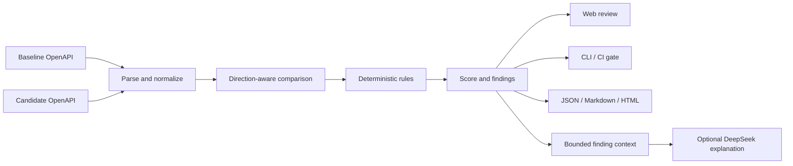

# ContractGuard

[English](README.en.md) · 简体中文

[](https://github.com/mingxian233/ContractGuard/actions/workflows/ci.yml)
[](LICENSE)
[](package.json)

**本地优先、结果可解释、可接入 CI 的 OpenAPI 向后兼容性分析平台。**

ContractGuard 比较一份已经发布的 OpenAPI 契约（baseline）与一份待发布契约（candidate），判断新版本是否可能破坏现有调用方。它不仅展示“改了什么”，还会说明风险等级、触发规则、准确位置、前后证据以及建议的迁移方式。

兼容性结论由确定性规则引擎产生；可选的 DeepSeek 集成只负责把既有结果整理成风险摘要、迁移计划和测试建议，不参与评分与发布门禁。

当前版本面向 OpenAPI 3.0/3.1。语法定义请以 [OpenAPI 3.0.4](https://spec.openapis.org/oas/v3.0.4.html)、[OpenAPI 3.1.2](https://spec.openapis.org/oas/v3.1.2.html)及[官方版本索引](https://spec.openapis.org/oas/)为准。

## 为什么需要它

两份 OpenAPI 文档都可以通过语法校验，升级仍可能破坏旧客户端。例如：

- 把可选查询参数改成必填，旧版 App 随即收到 `400`；
- 删除响应字段，仍在读取该字段的前端或 SDK 出现异常；
- 收窄请求枚举，使过去合法的输入不再被接受；
- 扩大响应枚举，使使用穷举分支的客户端遇到未知值；
- 修改成功状态码或新增鉴权要求，改变既有调用流程。

规范校验器回答“文档是否合法”，文本 diff 回答“哪些行发生变化”。ContractGuard 回答的是发布前更直接的问题：**旧客户端可能在哪里失效，为什么，以及团队应优先迁移和验证什么？**

## 适合哪些场景

| 场景 | 用法 |
| --- | --- |
| Pull request 门禁 | 在 CI 中比较已发布契约与本次候选契约，遇到高风险变更时以退出码 `2` 阻止合并 |
| API 设计评审 | 在实现之前通过 Web 工作台查看风险位置、证据与修复建议 |
| SDK/客户端迁移 | 导出 Markdown 或 HTML 报告，并用可选 AI 解读生成分阶段迁移与回归测试清单 |
| 版本审计与交接 | 将 JSON 报告留给自动化流程，将分析历史保存在本地文件中供团队复核 |

ContractGuard 是静态契约分析工具，不是运行时监控、API 安全扫描器或生产流量验证器。

## 核心能力

| 能力 | 当前实现 |
| --- | --- |
| 确定性规则引擎 | 检查路径、操作、参数、请求体、响应、媒体类型、Schema、鉴权与部分元数据变化 |
| 方向感知分析 | 分别判断请求输入与响应输出，避免把同一 Schema 变化机械地归为相同风险 |
| 可解释结果 | 输出稳定规则 ID、严重等级、契约位置、前后证据和修复建议 |
| Web 工作台 | 导入、拖拽或粘贴两份 YAML/JSON 规范，筛选结果、查看历史、浏览规则并导出报告 |
| CLI / CI 门禁 | 支持 `table`、`json`、`markdown`、`html` 输出和可配置失败阈值 |
| REST API | 创建、读取和删除分析，读取规则目录，导出 JSON/Markdown/HTML 报告 |
| 本地持久化 | 分析记录以 JSON 文件保存在本机，无需数据库 |
| 可选 DeepSeek 解读 | 对经过裁剪的 finding 生成结构化摘要、迁移步骤和测试建议 |

## 五分钟运行

### 1. 准备环境

- Node.js 22.13 或更高版本；
- pnpm 11.19.0（仓库已通过 `packageManager` 与锁文件固定版本）。

Node.js 22 通常可以通过 Corepack 启用 pnpm：

```bash
corepack enable
corepack prepare pnpm@11.19.0 --activate
```

如果系统没有 Corepack：

```bash
npm install --global pnpm@11.19.0
```

### 2. 安装、构建并启动

```bash
git clone https://github.com/mingxian233/ContractGuard.git
cd ContractGuard
pnpm install --frozen-lockfile
pnpm build
pnpm start
```

打开 `http://localhost:8080`，点击“载入演示规范”，再点击“运行兼容性分析”，即可完成第一次分析。AI 默认关闭，因此这一步不需要 API Key，也不会调用云端模型。

开发模式使用：

```bash
pnpm dev
```

此时 Web 开发服务器位于 `http://localhost:5173`，并将 `/api` 代理到本机 `8080` 端口。

### Windows 启动

如果 PowerShell 拦截 `pnpm.ps1`，使用对应的 `.cmd` 命令：

```powershell
pnpm.cmd install --frozen-lockfile
pnpm.cmd build
.\start-contractguard.bat
```

启动脚本会提示输入可选的 DeepSeek API Key。直接按 Enter 将仅启动本地规则引擎；输入的 Key 只存在于该次服务进程的环境中，不会写入项目文件。

## 使用 CLI 与 CI

完成构建后，可运行仓库自带的破坏性变更示例：

```bash
pnpm demo
```

生成 Markdown 报告并在发现 `breaking` 变化时让流程失败：

```bash
pnpm contractguard compare fixtures/petstore-v1.yaml fixtures/petstore-v2-breaking.yaml --format markdown --output contractguard-report.md --fail-on breaking
```

`--fail-on` 可取 `breaking`、`potentially-breaking` 或 `never`。CLI 退出码如下：

- `0`：分析完成，且没有达到指定失败阈值；
- `1`：文件读取、输入解析或程序执行失败；
- `2`：发现达到指定阈值的风险。

可直接复制的 GitHub Actions 示例位于 [`examples/github-actions-contractguard.yml`](examples/github-actions-contractguard.yml)。示例假设仓库中存在 `openapi/released.yaml` 和 `openapi/candidate.yaml`，使用前需替换成自己的文件路径。

## 可选：启用 DeepSeek

AI 解读不是核心分析的前置条件。服务端需要显式启用并读取以下环境变量：

```dotenv
CONTRACTGUARD_AI_ENABLED=true
DEEPSEEK_API_KEY=<YOUR_DEEPSEEK_API_KEY>
DEEPSEEK_BASE_URL=https://api.deepseek.com
DEEPSEEK_MODEL=deepseek-flash
CONTRACTGUARD_AI_TIMEOUT_MS=30000
CONTRACTGUARD_AI_MAX_CHANGES=50
CONTRACTGUARD_AI_MAX_OUTPUT_TOKENS=8192
```

`.env.example` 是配置模板；直接运行 Node.js 时不会自动加载 `.env`，需要由当前 shell、进程管理器或容器注入变量。Windows 用户可优先使用 `start-contractguard.bat`，避免把 Key 写进命令历史。

数据与决策边界：

- API Key 只由服务端读取，不会返回给浏览器；
- 默认不发送原始 OpenAPI，也不发送 finding 的完整 `before`/`after` 对象；
- 发往模型的是有数量与长度上限的 finding 摘要，仍可能包含内部接口名称；
- 模型响应必须通过运行时结构校验；
- AI 输出不能改变规则等级、兼容性得分、`compatible` 值或 CI 退出码。

完整的 PowerShell、bash、Docker、状态检查和 API 调用示例见 [`docs/ai-report-interpreter.md`](docs/ai-report-interpreter.md)。调用云端模型可能产生费用；启用前请确认组织的数据与隐私政策。

## Docker

```bash
docker compose up --build
```

打开 `http://localhost:8080`。Compose 默认只绑定 `127.0.0.1`，分析历史保存在 Docker volume 中。本项目没有内置身份认证、TLS、租户隔离、速率限制或 AI 预算控制，不能直接暴露到公网。部署要求见 [Security Policy](SECURITY.md)。

## 常见问题

| 现象 | 处理方法 |
| --- | --- |
| 找不到 `pnpm` | 运行 `corepack enable` 和 `corepack prepare pnpm@11.19.0 --activate`，或使用 npm 全局安装固定版本 |
| PowerShell 禁止运行 `pnpm.ps1` | 将命令改为 `pnpm.cmd`，无需修改系统执行策略 |
| 页面显示“分析引擎离线” | 确认 API 正在 `8080` 端口运行；开发模式需同时保留 `pnpm dev` 启动的两个进程 |
| CLI 返回退出码 `2` | 这是达到 `--fail-on` 风险阈值的预期门禁结果，不代表程序崩溃 |
| AI 显示未启用或未配置 | 同时设置 `CONTRACTGUARD_AI_ENABLED=true` 和 `DEEPSEEK_API_KEY`，然后重启 API 进程 |
| AI 返回无效或截断的 JSON | 重试；若持续出现，调高 `CONTRACTGUARD_AI_MAX_OUTPUT_TOKENS` 或降低 `CONTRACTGUARD_AI_MAX_CHANGES` |

更完整的运行问题见 [用户指南的故障排查](docs/user-guide.md#11-故障排查)和 [AI 错误说明](docs/ai-report-interpreter.md#10-错误与降级)。

## 系统如何工作



同一套核心引擎由 Web、REST API 与 CLI 复用。DeepSeek 位于单独的解释支路；模型不可用时，分析、门禁和报告导出仍可正常工作。

## 工程结构

```text
apps/
  api/       REST API、本地持久化、报告导出、DeepSeek 适配器
  cli/       本地与 CI 命令行入口
  web/       Vue 3 Web 工作台
packages/
  core/      OpenAPI 解析、本地引用解析、兼容性规则与评分
fixtures/    可复现的兼容/不兼容样例与评估清单
examples/    GitHub Actions 与 AI 请求示例
docs/        架构、规则、API、使用、开发、评估和验证文档
scripts/     端到端冒烟测试
```

这个项目重点展示的不是“接入了一个模型”，而是完整的软件工程闭环：领域规则建模、前后端复用、稳定 CLI 契约、可复现实例、自动化测试、CI 门禁，以及将生成式解释与确定性决策隔离的可信 AI 设计。

## 验证

```bash
pnpm check
```

`pnpm check` 会依次完成构建、类型检查、测试、文档链接与示例配置检查，以及端到端冒烟验证。需要定向重跑时可使用 `pnpm docs:check`、`pnpm config:check` 或 `pnpm smoke`。GitHub Actions 会在 Node.js 22 环境中执行同类检查，并确认破坏性 fixture 能触发预期门禁。已记录的本地验证范围见 [`docs/verification.md`](docs/verification.md)；它不等同于对所有真实 OpenAPI 的准确率证明。

## 当前边界

ContractGuard 重点支持 OpenAPI 3.0/3.1 与同一文档内的 JSON Pointer `$ref`。以下内容仍需要其他工具或人工评审：

- Swagger 2.0；
- 外部 URL 与跨文件引用；
- 一般化的 `oneOf`、`anyOf`、`allOf`、discriminator 等组合语义；
- 业务规则、数据库迁移、性能、SLA 与运行时流量行为；
- 完整的消费者契约测试、集成测试和灰度发布策略。

兼容性得分是用于风险排序的启发式指标，不是生产安全的数学证明。规则覆盖与判定口径见 [`docs/compatibility-rules.md`](docs/compatibility-rules.md)。

## 文档导航

- [项目背景、实际场景与展示价值](docs/project-overview.md)
- [用户指南](docs/user-guide.md)
- [系统架构](docs/architecture.md)
- [兼容性规则与判定方向](docs/compatibility-rules.md)
- [REST API](docs/api-reference.md)
- [DeepSeek AI 报告解释器](docs/ai-report-interpreter.md)
- [开发与扩展规则](docs/development.md)
- [评估方法与结果](docs/evaluation.md)
- [验证记录](docs/verification.md)
- [交付与发布检查](docs/delivery-checklist.md)
- [安全策略](SECURITY.md)

## License

[MIT](LICENSE)
