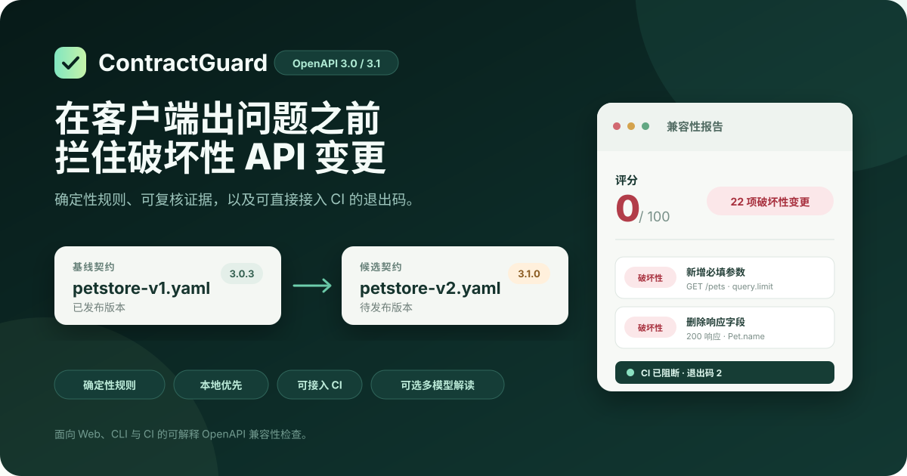
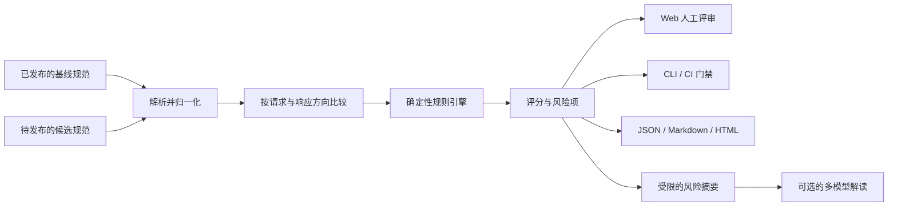

# ContractGuard：OpenAPI 兼容性检查工具

[English](README.md) · 简体中文

[](https://github.com/mingxian233/ContractGuard/actions/workflows/ci.yml)
[](https://github.com/mingxian233/ContractGuard/releases)
[](LICENSE)
[](package.json)



**接口文档能通过校验，不代表现有客户端还能正常工作。**

ContractGuard 会对比已经发布的基线规范（baseline）与待发布的候选规范（candidate），找出删除接口、新增必填参数、收紧请求约束、删除响应字段等可能破坏兼容性的变化。每条结果都有风险等级、稳定的规则编号和文档中的具体位置，并在适用时附带变更前后值与处理建议，既方便人工评审，也能直接用作 CI 合并门禁。

兼容性判断完全由可重复执行的规则引擎给出。可选的 AI 解读功能通过 OpenAI-compatible Chat Completions 接口支持 DeepSeek、OpenAI、Gemini、Ollama 等模型配置，用来整理风险摘要、迁移步骤和测试建议；AI 不会修改检测结果、兼容性得分或 CI 退出码。

当前版本面向 OpenAPI 3.0 和 3.1。规范语法请以 [OpenAPI 3.0.4](https://spec.openapis.org/oas/v3.0.4.html)、[OpenAPI 3.1.2](https://spec.openapis.org/oas/v3.1.2.html)和[官方版本索引](https://spec.openapis.org/oas/)为准。

**[查看示例报告](examples/reports/petstore-breaking.md) · [五分钟跑起来](#五分钟跑起来) · [接入 CLI 与 CI](#接入-cli-与-ci) · [了解判定规则](docs/compatibility-rules.md)**

## 它解决什么问题

API 升级最棘手的情况，往往不是规范文件写错了，而是两份文件都合法，新版本却悄悄破坏了已经上线的调用方。例如：

- 把可选查询参数改成必填后，旧客户端开始收到 `400`；
- 删除响应字段后，仍在读取该字段的前端或 SDK 出现异常；
- 收窄请求枚举后，过去合法的输入不再被接受；
- 扩大响应枚举后，使用穷举分支的客户端遇到未知值；
- 修改成功状态码或新增鉴权要求后，原有调用流程无法继续。

规范校验器回答“这份文档是否合法”，普通文本 diff 回答“哪些行发生了变化”。ContractGuard 关注的是发布前真正需要回答的问题：**哪些现有调用方可能受到影响，原因是什么，团队应该先改哪里、测哪里？**

## 先看结果

安装后运行仓库自带的破坏性变更样例：

```bash
pnpm demo
```

```text
ContractGuard: petstore-v1.yaml -> petstore-v2-breaking.yaml
Score 0/100 | BREAKING CHANGES | breaking 22 | potential 8 | safe 1 | info 1
```

每个风险项都有规则编号、严重程度和 OpenAPI 位置，并在适用时提供变更证据与修复建议。你可以在 Web 工作台中逐项查看，也可以导出 JSON、Markdown 或 HTML；放进 CI 后，还能用退出码 `2` 阻止不兼容的 Pull Request 合并。

## 适合放在哪些流程里

| 场景 | ContractGuard 能做什么 |
| --- | --- |
| Pull Request 门禁 | 在 CI 中比较线上契约与候选契约，风险达到阈值时阻止合并 |
| API 设计评审 | 在编码之前确认接口改动会影响哪些客户端，并查看证据和修改建议 |
| SDK 与客户端迁移 | 导出可分享的报告，配合可选 AI 解读整理迁移顺序和回归测试清单 |
| 版本审计与交接 | 保存带输入指纹和规则策略指纹的结果，方便复核分析依据 |

ContractGuard 是静态契约分析工具，不是运行时监控、API 安全扫描器，也不能代替真实流量回放和消费者契约测试。

## 主要能力

| 能力 | 当前实现 |
| --- | --- |
| 确定性规则引擎 | 检查路径、操作、参数、请求体、响应、媒体类型、Schema、鉴权及部分元数据变化 |
| 按数据流方向判断 | 区分“客户端发送的请求”和“服务端返回的响应”，避免把同一种 Schema 改动一概而论 |
| 可解释结果 | 输出稳定规则编号、风险等级和契约位置，并在适用时附带变更前后值与修复建议 |
| Web 工作台 | 导入、拖入或粘贴两份 YAML/JSON 规范，筛选结果、查看历史并导出报告 |
| CLI 与 CI 门禁 | 支持 `table`、`json`、`markdown`、`html` 输出及可配置的失败阈值 |
| REST API | 创建、读取和删除分析，查询规则目录，导出多种格式的报告 |
| 本地保存 | 将分析历史保存为本机 JSON 文件，无需额外部署数据库 |
| 规则策略（Policy as Code） | 通过受校验的 JSON 启停或调整规则等级，并自定义评分权重 |
| 可核验的审计信息 | 记录基线规范、候选规范和实际规则策略的 SHA-256 指纹 |
| 可选多模型解读 | 从服务端允许的模型配置中选择，把受限的风险摘要整理成迁移和测试建议 |

## 五分钟跑起来

### 1. 准备环境

- Node.js 22.13 或更高版本；
- pnpm 11.19.0，版本已经通过仓库的 `packageManager` 字段和锁文件固定。

Node.js 22 通常可以通过 Corepack 启用 pnpm：

```bash
corepack enable
corepack prepare pnpm@11.19.0 --activate
```

如果系统没有 Corepack，也可以使用 npm：

```bash
npm install --global pnpm@11.19.0
```

### 2. 安装、构建并启动

```bash
git clone https://github.com/mingxian233/ContractGuard.git
cd ContractGuard
pnpm install --frozen-lockfile
pnpm build
pnpm start
```

打开 `http://localhost:8080`，点击“载入演示规范”，再点击“运行兼容性分析”，即可完成第一次检查。AI 默认关闭，因此不需要 API Key，也不会向任何模型服务发送请求。

开发模式使用：

```bash
pnpm dev
```

Web 开发服务器会运行在 `http://localhost:5173`，并把 `/api` 请求代理到本机 `8080` 端口。

### Windows 一键启动

Windows 用户可以直接运行 BAT 启动器。第一次运行时，用一条命令完成依赖安装、构建和启动：

```powershell
.\start-contractguard.bat --install
```

常用命令：

```powershell
# 正常启动
.\start-contractguard.bat

# 修改源码后重新构建并启动
.\start-contractguard.bat --build

# 关闭 AI，只运行确定性分析器
.\start-contractguard.bat --no-ai

# 检查环境和配置，不启动服务
.\start-contractguard.bat --check
```

如果 `config\llm-providers.local.json` 存在，BAT 启动器会自动读取；也可以通过 `--config` 指定其他配置文件。脚本兼容 Windows PowerShell 5.1，输入的密钥只保存在本次服务进程中，不会写进项目文件。完整参数见[用户指南](docs/user-guide.md)或运行 `start-contractguard.bat --help`。

## 接入 CLI 与 CI

完成构建后，可以直接比较两份规范：

```bash
pnpm contractguard compare fixtures/petstore-v1.yaml fixtures/petstore-v2-breaking.yaml --format markdown --output contractguard-report.md --fail-on breaking
```

`--fail-on` 支持 `breaking`、`potentially-breaking` 和 `never`。CLI 退出码约定如下：

- `0`：分析正常完成，结果没有达到失败阈值；
- `1`：文件读取、规范解析或程序执行失败；
- `2`：发现达到指定阈值的兼容性风险。

仓库提供了可直接改造的 [GitHub Actions 示例](examples/github-actions-contractguard.yml)。示例默认比较 `openapi/released.yaml` 与 `openapi/candidate.yaml`，使用时替换为项目自己的文件路径即可。

### 自定义规则策略

如果团队需要调整判定口径，可以复制规则策略样例：

```bash
cp config/rule-policy.example.json config/rule-policy.local.json
pnpm contractguard compare fixtures/petstore-v1.yaml fixtures/petstore-v2-breaking.yaml --policy config/rule-policy.local.json --fail-on breaking
```

策略文件可以关闭已知规则、调整风险等级和修改评分权重。API 服务通过 `CONTRACTGUARD_POLICY_CONFIG` 读取同一份策略。新生成的结果会同时记录基线规范、候选规范和规范化策略的 SHA-256 指纹，便于确认一份报告究竟由哪些输入和规则产生。详见[规则策略与输入指纹](docs/rule-policy.md)。

## 可选：接入多种 LLM

AI 解读不是运行兼容性分析的前置条件。仓库提供的[配置示例](config/llm-providers.example.json)已经包含 DeepSeek、OpenAI、Gemini 和本地 Ollama；也可以为其他兼容 OpenAI Chat Completions 接口的服务添加受控配置。

先复制配置文件：

```powershell
Copy-Item config/llm-providers.example.json config/llm-providers.local.json
$env:CONTRACTGUARD_LLM_CONFIG = './config/llm-providers.local.json'
$env:DEEPSEEK_API_KEY = '<YOUR_DEEPSEEK_API_KEY>'
pnpm start
```

在副本中只启用计划使用的模型配置，并通过 `activeProfile` 选择默认项。`allowRequestProfileOverride` 为 `true` 时，Web 和 API 可以在已启用的配置之间切换；为 `false` 时，所有请求都使用默认配置。完整字段定义见对应的 [JSON Schema](config/llm-providers.schema.json)。

真实密钥不能写入 JSON。配置文件只保存环境变量名称，例如 `DEEPSEEK_API_KEY` 或 `OPENAI_API_KEY`，实际值由服务端进程读取。浏览器只能提交服务端允许的配置 ID，不能自行指定模型地址、模型名称、请求头或密钥。

无论选择哪个模型，安全和决策边界都保持不变：

- 默认不发送原始 OpenAPI 文档，也不发送完整的 `before`/`after` 对象；
- 模型只接收数量和长度都受限制的风险摘要，其中仍可能包含内部接口名称；
- 模型返回值必须通过运行时结构校验；
- AI 不能修改规则等级、兼容性得分、`compatible` 值或 CI 退出码；
- 不会在一个模型失败后自动切换到其他服务，避免数据在未授权的边界之间流动。

完整字段、PowerShell/bash 用法、Docker 配置、状态检查和 API 示例见[多 LLM 报告解释器指南](docs/ai-report-interpreter.md)。云端模型可能收费；启用前请自行确认所选服务当前的数据政策、使用条款和价格。

## Docker

```bash
docker compose up --build
```

打开 `http://localhost:8080` 即可使用。Compose 默认只监听 `127.0.0.1`，分析历史保存在 Docker volume 中。

项目目前没有内置身份认证、TLS、租户隔离、速率限制或 AI 预算控制，因此不要直接暴露到公网。部署前请阅读[安全策略](SECURITY.md)。

## 系统如何工作



Web、REST API 和 CLI 共用同一套核心引擎。AI 位于独立的解读链路上；即使没有配置模型，或者模型服务暂时不可用，规则分析、CI 门禁和报告导出仍然可以正常工作。

## 常见问题

| 现象 | 处理方法 |
| --- | --- |
| 找不到 `pnpm` | 运行 `corepack enable` 和 `corepack prepare pnpm@11.19.0 --activate`，或使用 npm 安装固定版本 |
| PowerShell 禁止运行 `pnpm.ps1` | 改用 `pnpm.cmd`，不需要修改系统执行策略 |
| 页面提示“分析引擎离线” | 确认 API 正在监听 `8080`；开发模式下要保留 `pnpm dev` 启动的两个进程 |
| CLI 返回退出码 `2` | 说明结果触发了 `--fail-on` 门禁，不代表程序崩溃 |
| AI 显示未启用或未配置 | 检查配置文件中的 `enabled`、`activeProfile`、对应模型配置以及所需环境变量 |
| AI 返回参数错误或无效 JSON | 检查该接口支持的 `structuredOutput` 与 `tokenLimitParameter`，必要时减少发送的风险项或增加输出上限 |

更多排查步骤见[用户指南](docs/user-guide.md#11-故障排查)和 [AI 错误说明](docs/ai-report-interpreter.md#10-错误与降级)。

## 当前边界

ContractGuard 重点支持 OpenAPI 3.0/3.1，以及同一份文档内部的 JSON Pointer `$ref`。以下内容仍需要其他工具或人工评审：

- Swagger 2.0；
- 外部 URL 和跨文件引用；
- 完整的 `oneOf`、`anyOf`、`allOf`、discriminator 等组合语义；
- 业务规则、数据库迁移、性能、SLA 和运行时流量行为；
- 完整的消费者契约测试、集成测试和灰度发布验证。

兼容性得分用于帮助团队排序风险，不是生产安全的数学证明。测试样例用于验证规则与流程，也不代表对所有真实项目的准确率。具体覆盖范围见[兼容性规则说明](docs/compatibility-rules.md)和[验证记录](docs/verification.md)。

## 项目结构

```text
apps/
  api/       REST API、本地存储、报告导出和多模型适配器
  cli/       本地与 CI 命令行入口
  web/       Vue 3 Web 工作台
packages/
  core/      OpenAPI 解析、本地引用解析、兼容性规则和评分
fixtures/    可复现的兼容/不兼容样例与评估清单
examples/    GitHub Actions 和 AI 请求示例
config/      规则策略、模型配置及其 JSON Schema
docs/        架构、规则、API、使用、开发、评估与验证文档
scripts/     端到端冒烟测试和 Windows 启动器
```

项目的核心设计原则是把“可重复的兼容性判断”与“生成式解释”分开：规则引擎负责做决定，AI 只负责把已经确认的结果讲清楚。

## 如何验证

```bash
pnpm check
```

这条命令会依次执行构建、类型检查、自动化测试、文档链接检查、示例配置校验和端到端冒烟测试。需要单独重跑时，可以使用 `pnpm docs:check`、`pnpm config:check` 或 `pnpm smoke`。GitHub Actions 会在 Node.js 22 环境执行同类检查，并确认破坏性样例能够触发预期门禁。

可复现的本地验证范围记录在 [`docs/verification.md`](docs/verification.md) 中。

## 继续阅读

- [项目背景、实际场景与设计取舍](docs/project-overview.md)
- [用户指南](docs/user-guide.md)
- [系统架构](docs/architecture.md)
- [兼容性规则与判定方向](docs/compatibility-rules.md)
- [规则策略、评分与输入指纹](docs/rule-policy.md)
- [REST API](docs/api-reference.md)
- [多 LLM 报告解释器](docs/ai-report-interpreter.md)
- [开发与扩展规则](docs/development.md)
- [评估方法](docs/evaluation.md)
- [验证记录](docs/verification.md)
- [交付与发布检查](docs/delivery-checklist.md)
- [版本记录](CHANGELOG.md)
- [贡献指南](CONTRIBUTING.md)
- [安全策略](SECURITY.md)

## 开源许可

[MIT](LICENSE)

欢迎提交经过脱敏、能够稳定复现的误报或漏报样例。参与方式见[贡献指南](CONTRIBUTING.md)。
