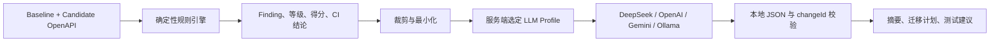

# 多 LLM AI 报告解释器

ContractGuard V1.1 的 AI 报告解释器可以在服务端配置多个 LLM 档案，并由用户从管理员允许的档案中选择。首版通过 OpenAI-compatible Chat Completions 协议支持 DeepSeek、OpenAI、Gemini 和 Ollama；它不包含 Anthropic 原生协议，也不会在失败时自动把数据转发给另一个提供方。

AI 功能默认关闭且不是兼容性分析的前置条件。所有严重等级、得分、`compatible` 和 CI 退出码仍由确定性规则引擎产生。

## 1. 工作边界



- 规则引擎是唯一兼容性判定来源；模型不能修改 finding、分数或门禁。
- 模型只解释已经产生的 finding，并且输出必须通过本地结构、长度、枚举和 `changeId` 校验。
- 未启用、凭据缺失、超时或上游失败时，普通分析、CLI、导出和历史记录继续工作。
- 浏览器只能选择服务端公布的档案 ID，不能提交任意 URL、模型、请求头或密钥。

## 2. 支持范围

| Provider | V1.1 调用方式 | 示例地址 | 备注 |
| --- | --- | --- | --- |
| DeepSeek | `openai-chat` | `https://api.deepseek.com` | 示例使用 JSON Object，并关闭 thinking |
| OpenAI | `openai-chat` | `https://api.openai.com/v1` | 可启用 JSON Schema，并为新模型使用 `max_completion_tokens` |
| Gemini | `openai-chat` | `https://generativelanguage.googleapis.com/v1beta/openai` | 使用官方 OpenAI 兼容端点 |
| Ollama | `openai-chat` | `http://127.0.0.1:11434/v1` | 本机回环地址允许 HTTP；模型必须事先安装 |

“OpenAI compatible”并不表示所有厂商支持完全相同的参数。管理员必须为每个档案正确声明 `structuredOutput`、`thinkingControl` 和 `tokenLimitParameter`。服务当前只编译并允许 `openai-chat` 适配器；未知 provider、adapter 和配置字段会在启动时被拒绝。

协议与能力应以官方资料为准：

- [DeepSeek API 文档](https://api-docs.deepseek.com/)与 [JSON Output 指南](https://api-docs.deepseek.com/guides/json_mode/)；
- [OpenAI Structured Outputs](https://developers.openai.com/api/docs/guides/structured-outputs)；
- [OpenAI Chat Completions 参数](https://developers.openai.com/api/reference/resources/chat/subresources/completions/methods/create)；
- [Gemini OpenAI compatibility](https://ai.google.dev/gemini-api/docs/openai)；
- [Ollama OpenAI compatibility](https://docs.ollama.com/api/openai-compatibility)。

模型、配额、数据政策和价格都可能变化，本项目不写死价格，也不保证某个模型 ID 永久可用。

## 3. 配置文件与优先级

仓库提供：

- [`config/llm-providers.example.json`](../config/llm-providers.example.json)：DeepSeek、OpenAI、Gemini、Ollama 示例；
- [`config/llm-providers.schema.json`](../config/llm-providers.schema.json)：严格 JSON Schema；
- [`.env.example`](../.env.example)：路径、密钥名称和旧版变量模板。

推荐先创建不会提交到 Git 的本地副本：

```powershell
Copy-Item config/llm-providers.example.json config/llm-providers.local.json
$env:CONTRACTGUARD_LLM_CONFIG = './config/llm-providers.local.json'
```

加载规则如下：

1. 设置 `CONTRACTGUARD_LLM_CONFIG` 时，服务读取并严格验证该 JSON；配置不可读或非法时启动失败，不会静默改用另一服务。
2. 未设置该变量时，服务使用旧版 `CONTRACTGUARD_AI_ENABLED` 与 `DEEPSEEK_*` 环境变量，保持 V1.0.1 启动方式兼容。
3. Node.js 不会自动读取任意 `.env` 文件；应由 shell、进程管理器或 Docker Compose 注入环境变量。

配置文件上限为 256 KiB，未知字段会被拒绝。`activeProfile` 必须指向一个存在且已启用的档案。

## 4. JSON 字段

```json
{
  "$schema": "./llm-providers.schema.json",
  "schemaVersion": 1,
  "enabled": true,
  "activeProfile": "deepseek-cloud",
  "allowRequestProfileOverride": true,
  "defaults": {
    "timeoutMs": 30000,
    "maxChanges": 50,
    "maxOutputTokens": 8192,
    "maxResponseBytes": 131072
  },
  "profiles": {
    "deepseek-cloud": {
      "enabled": true,
      "displayName": "DeepSeek",
      "provider": "deepseek",
      "adapter": "openai-chat",
      "baseUrl": "https://api.deepseek.com",
      "model": "deepseek-flash",
      "auth": {
        "type": "bearer",
        "secretEnv": "DEEPSEEK_API_KEY"
      },
      "capabilities": {
        "structuredOutput": "json-object",
        "thinkingControl": "disabled",
        "tokenLimitParameter": "max_tokens"
      },
      "dataBoundary": "deepseek-cloud"
    }
  }
}
```

### 顶层字段

| 字段 | 说明 |
| --- | --- |
| `schemaVersion` | 当前只能为 `1` |
| `enabled` | AI 总开关；`false` 时所有 AI 调用返回禁用错误 |
| `activeProfile` | 未显式选择时使用的默认档案 ID |
| `allowRequestProfileOverride` | 是否允许请求用 `providerId` 选择另一已启用档案 |
| `defaults.timeoutMs` | 单次请求超时，范围 1–120000 ms |
| `defaults.maxChanges` | 最多发送的 finding 数，范围 1–200 |
| `defaults.maxOutputTokens` | 请求的最大输出 token，范围 512–32768 |
| `defaults.maxResponseBytes` | 最多读取的响应字节数，范围 1024–1048576 |
| `profiles` | 1–32 个服务端档案；键是稳定档案 ID |

### Profile 字段

| 字段 | 说明 |
| --- | --- |
| `enabled` | 是否允许调用该档案 |
| `displayName` | UI 和错误信息中的显示名 |
| `provider` | 安全标识符；内置示例为 `deepseek`、`openai`、`gemini`、`ollama`，其他兼容端点也可使用自定义标识 |
| `adapter` | V1.1 只能为 `openai-chat` |
| `baseUrl` | API 根地址；若末尾没有 `/chat/completions`，适配器会补齐 |
| `model` | 发送给该端点的模型 ID；应按账号和官方文档填写 |
| `auth` | 云端通常为 `bearer + secretEnv`；本地 Ollama 可使用 `none` |
| `capabilities` | 描述结构化输出、thinking 与输出 token 限制参数能力 |
| `dataBoundary` | 供管理员识别数据边界的说明标签；它本身不是网络访问控制 |

档案 ID 与 provider 标识只能使用小写字母、数字、点、下划线与连字符，最长 64 字符。云端 URL 必须使用公共主机名和 HTTPS，并拒绝 IP literal、`.local` 与 `.localhost` 主机。任何回环地址档案都必须声明 `dataBoundary: "local"`，反过来本地边界也只能指向 `localhost`、`127.0.0.1` 或 `::1`；这同样适用于 LM Studio、LocalAI 或自定义本地兼容端点，不限定 provider 名称。URL 不能含用户名、密码、查询串或片段，适配器也拒绝 HTTP 重定向，避免把 Authorization 头转发到意外地址。

## 5. 结构化输出能力

| `structuredOutput` | 发送的参数 | 适用情况 |
| --- | --- | --- |
| `json-schema` | strict `response_format: json_schema` | 端点明确支持 JSON Schema |
| `json-object` | `response_format: json_object` | 端点支持 JSON Mode，但不保证严格 schema |
| `prompt-only` | 不发送 `response_format` | 本地或兼容端点不接受该参数 |

`thinkingControl` 可为：

- `disabled`：发送 DeepSeek 风格的 `thinking: {"type":"disabled"}`；
- `none`：不发送 thinking 参数。

`tokenLimitParameter` 可为：

- `max_tokens`：发送通用兼容端点常用的 `max_tokens`；省略字段时为兼容旧配置而使用此值；
- `max_completion_tokens`：发送 OpenAI 新 Chat Completions 模型使用的参数，且兼容不接受旧 `max_tokens` 的 o-series 模型；
- `none`：不发送输出 token 限制参数，仅依赖端点默认值和响应字节上限。

声明能力并不能取代本地验证。三种模式的响应都会经过同一套解析、字段上限、合法 finding ID 和响应体大小检查。

## 6. 密钥管理

JSON 只保存环境变量名称，绝不能保存真实 key：

```json
"auth": {
  "type": "bearer",
  "secretEnv": "OPENAI_API_KEY"
}
```

在 PowerShell 当前进程中注入：

```powershell
$secureKey = Read-Host -Prompt 'Provider API Key' -AsSecureString
$env:OPENAI_API_KEY = [System.Net.NetworkCredential]::new('', $secureKey).Password
```

运行结束后可清理：

```powershell
Remove-Item Env:OPENAI_API_KEY -ErrorAction SilentlyContinue
Remove-Item Env:CONTRACTGUARD_LLM_CONFIG -ErrorAction SilentlyContinue
```

生产环境应使用进程管理器、CI secret 或 secret manager。不要把 key 放入浏览器、OpenAPI 文件、请求体、截图、配置 JSON、命令行参数或 Git。

## 7. 启动示例

### Windows BAT

```powershell
Copy-Item config/llm-providers.example.json config/llm-providers.local.json
.\start-contractguard.bat --install --config config\llm-providers.local.json
```

后续直接运行 `.\start-contractguard.bat`；源码改变后使用 `.\start-contractguard.bat --build`。BAT 只是兼容入口，主要逻辑位于 `scripts/start-contractguard.ps1`。脚本会先用服务端的同一套严格解析器验证配置，再读取活动档案；只有顶层 AI 与活动档案均启用、认证类型为 bearer 且对应 `secretEnv` 为空时，才会用 `Read-Host -AsSecureString` 提示输入。其他可选档案的 key 应在启动前通过当前进程环境或 secret manager 注入。若不传配置路径且没有 `config/llm-providers.local.json`，脚本进入旧版 DeepSeek 模式，并保留已有 DeepSeek URL、模型、限制与 key 设置。

仅验证而不启动或询问密钥：

```powershell
.\start-contractguard.bat --check --config config\llm-providers.local.json --policy config\rule-policy.example.json
```

该模式会检查 Node.js 版本、依赖目录、Core/API/Web 构建产物是否存在且未过期、多 LLM JSON、规则策略、监听端口和旧版环境开关；它不会启动服务或询问密钥。`--no-ai` 可强制只启用确定性规则引擎，`--host`/`--port` 可覆盖监听地址，`--no-pause` 适合自动化调用。启动器不会读取 `.env` 文件。若自定义路径含 `&` 等 CMD 元字符，请改用 `CONTRACTGUARD_LLM_CONFIG`/`CONTRACTGUARD_POLICY_CONFIG` 环境变量，或通过 `powershell.exe -ExecutionPolicy Bypass -File scripts\start-contractguard.ps1` 直接调用实现脚本。完整帮助可运行 `.\start-contractguard.bat --help`。

### PowerShell 直接启动

```powershell
$env:CONTRACTGUARD_LLM_CONFIG = './config/llm-providers.local.json'
$env:DEEPSEEK_API_KEY = '<YOUR_KEY>'
pnpm start
```

### Bash

```bash
export CONTRACTGUARD_LLM_CONFIG=./config/llm-providers.local.json
read -rsp 'Provider API Key: ' DEEPSEEK_API_KEY && echo
export DEEPSEEK_API_KEY
pnpm start
```

### Docker Compose

Compose 把仓库的 `config/` 只读挂载到容器 `/app/config`。在项目根目录创建 `.env`：

```dotenv
CONTRACTGUARD_LLM_CONFIG=./config/llm-providers.local.json
DEEPSEEK_API_KEY=<YOUR_KEY>
```

然后运行：

```bash
docker compose up --build
```

Ollama 示例的 `127.0.0.1` 在容器内指向容器自身，并不自动指向宿主机。当前安全策略只允许回环 HTTP，因此最简单的本地 Ollama 用法是直接在宿主机运行 ContractGuard；容器跨主机访问应先通过受信任的 HTTPS 反向代理，并按实际地址配置。

## 8. 状态与页面选择

```bash
curl http://localhost:8080/api/ai/status
```

多档案状态示例：

```json
{
  "enabled": true,
  "configured": true,
  "available": true,
  "provider": "deepseek",
  "model": "deepseek-flash",
  "promptVersion": "ai-explainer-v1",
  "activeProfile": "deepseek-cloud",
  "activeProviderId": "deepseek-cloud",
  "defaultProviderId": "deepseek-cloud",
  "allowRequestProfileOverride": true,
  "allowRequestProviderOverride": true,
  "providers": [
    {
      "id": "deepseek-cloud",
      "label": "DeepSeek",
      "displayName": "DeepSeek",
      "provider": "deepseek",
      "model": "deepseek-flash",
      "enabled": true,
      "configured": true,
      "available": true,
      "local": false
    }
  ]
}
```

`configured` 表示必要凭据存在，`available` 表示总开关、档案开关与凭据条件均满足。状态接口不会调用上游，因此它不证明网络、账号余额、配额或模型 ID 有效，也不会消耗 token。

当 `allowRequestProfileOverride` 为 `true` 时，Web 页面展示可用档案选择器。关闭后页面只使用活动档案。状态响应只包含经过筛选的名称、模型和可用性，不返回 base URL、`secretEnv` 或 key。

## 9. 调用 AI review

先创建分析，再提交目标档案 ID：

```json
{
  "language": "zh-CN",
  "focus": "优先解释旧版移动客户端的风险和迁移顺序。",
  "providerId": "deepseek-cloud"
}
```

`providerId` 可省略，此时使用 `activeProfile`。若服务器禁止覆盖、ID 不存在、档案已禁用或缺少密钥，接口会返回明确错误；不会自动切换到其他厂商。

```bash
curl -X POST http://localhost:8080/api/analyses/ANALYSIS_ID/ai-review \
  -H "Content-Type: application/json" \
  --data @examples/ai-review-request.json
```

成功结果会记录实际使用的档案：

```json
{
  "schemaVersion": "1.0",
  "analysisId": "ANALYSIS_ID",
  "provider": "deepseek",
  "providerId": "deepseek-cloud",
  "providerLabel": "DeepSeek",
  "model": "deepseek-flash",
  "generatedAt": "2026-09-23T08:00:00.000Z",
  "promptVersion": "ai-explainer-v1",
  "overview": {
    "headline": "候选接口包含需要优先处理的破坏性变化",
    "executiveSummary": "应保留兼容入口并分阶段迁移消费者。",
    "riskLevel": "high"
  },
  "keyRisks": [],
  "migrationPlan": [],
  "testSuggestions": [],
  "caveats": []
}
```

完整请求与响应字段见 [REST API 文档](./api-reference.md)。

## 10. 发送给模型的数据

默认不会发送 baseline 或 candidate 的原始 OpenAPI 文本，也不会发送 finding 的完整 `before`/`after` 对象。服务端只发送：

- 分析 ID、显示文件名和有限版本元数据；
- 确定性得分、兼容结论与分类计数；
- 最多 `defaults.maxChanges` 条经过裁剪的 finding；
- 输出语言和可选 `focus`。

finding 只保留 ID、rule ID、severity、category、location、message 和可选 recommendation。尽管已经最小化，路径、消息和建议仍可能暴露内部接口或业务名称。选择任何云端档案前，都应完成数据分级、脱敏和组织审批；选择页面中的另一个 Provider 意味着数据会发送到该 Provider 所代表的边界。

## 11. 错误与降级

| HTTP | `error.code` | 处理建议 |
| --- | --- | --- |
| `400` | `INVALID_AI_REVIEW_REQUEST` | 检查 `language`、`focus` 和 `providerId` |
| `400` | `AI_PROVIDER_OVERRIDE_DISABLED` | 省略 `providerId` 或由管理员允许档案选择 |
| `400` | `AI_PROVIDER_NOT_FOUND` | 使用状态接口返回的档案 ID |
| `503` | `AI_DISABLED` | 将 JSON 顶层 `enabled` 设为 `true`；旧模式检查环境开关 |
| `503` | `AI_PROVIDER_DISABLED` | 启用该档案或选择活动档案 |
| `503` | `AI_NOT_CONFIGURED` | 注入该档案 `secretEnv` 对应的 key |
| `504` | `AI_UPSTREAM_TIMEOUT` | 检查网络并调整 `defaults.timeoutMs` |
| `502` | `AI_UPSTREAM_UNAVAILABLE` | 检查 DNS、代理、TLS 和出口策略 |
| `502` | `AI_UPSTREAM_ERROR` | 检查账号、模型、配额与端点；服务不会返回上游正文 |
| `502` | `AI_INVALID_RESPONSE` | 核对能力声明、输出上限和所选模型的结构化输出能力 |

502/504 不会使原确定性报告失效。不要在无限循环中自动重试可能计费的请求。V1.1 没有自动 fallback：上游失败后不会把同一份 finding 隐式发送给另一家服务。

## 12. 旧版 DeepSeek 兼容模式

不设置 `CONTRACTGUARD_LLM_CONFIG` 时，以下变量继续有效：

```dotenv
CONTRACTGUARD_AI_ENABLED=true
DEEPSEEK_API_KEY=<YOUR_DEEPSEEK_API_KEY>
DEEPSEEK_BASE_URL=https://api.deepseek.com
DEEPSEEK_MODEL=deepseek-flash
CONTRACTGUARD_AI_TIMEOUT_MS=30000
CONTRACTGUARD_AI_MAX_CHANGES=50
CONTRACTGUARD_AI_MAX_OUTPUT_TOKENS=8192
CONTRACTGUARD_AI_MAX_RESPONSE_BYTES=131072
```

该模式会生成单个 `deepseek` 档案，且不允许请求覆盖。它用于平滑升级，不适合管理多个服务；新部署建议迁移到 JSON。

## 13. 上线前检查

- 配置文件和所有真实 key 均未进入 Git、镜像层、日志或浏览器包；
- 只启用了经过组织审批的档案，`activeProfile` 与数据边界符合预期；
- `structuredOutput`、`thinkingControl`、`tokenLimitParameter`、模型 ID 和 base URL 已用当前官方文档核对；
- 云端调用前已确认 finding 中不含禁止外发的信息；
- 网络部署已增加 TLS、身份认证、速率限制、并发/费用控制和审计；
- 自动化仍以确定性报告为准，不以 AI 自然语言决定发布；
- 使用 fake provider 完成日常测试，只有人工明确接受费用时才执行真实云端 smoke test。
