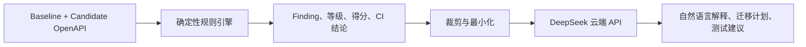

# DeepSeek AI 报告解释器

ContractGuard 的 AI 报告解释器把确定性兼容性分析结果转换为更容易阅读的风险摘要、关键影响、迁移步骤和测试建议。它使用 DeepSeek 云端 API，默认关闭，只有管理员显式配置后才可调用。

## 1. 它负责什么，不负责什么

系统采用“确定性规则 + 生成式解释”的混合架构：



其中：

- **规则引擎是唯一兼容性判定来源。** `severity`、`score`、`compatible` 和 CLI/CI 退出码都不受模型输出影响。
- **DeepSeek 只解释已有 finding。** 它不能新增、删除或改写确定性结论，也不能让一次失败的 CI 检查变为通过。
- **模型内容是辅助意见。** 迁移前仍应由工程师核对 OpenAPI、消费者契约测试、流量和版本策略。
- **AI 故障不影响核心分析。** 未启用、未配置、超时或上游异常时，普通分析、报告导出和 CLI 仍可使用；AI 接口返回明确错误。

这种分工保留了兼容性检查的可复现性，同时减少阅读大量规则条目的成本。

## 2. 发送到云端的数据

AI 请求默认不会发送 baseline 或 candidate 的原始 OpenAPI 文本。服务端只从已保存的分析结果中构造最小化上下文，包括：

- 分析 ID、文件显示名、引擎版本、OpenAPI 标题/版本等有限元数据；
- 确定性得分、兼容结论、摘要和风险计数；
- 最多 `CONTRACTGUARD_AI_MAX_CHANGES` 条经过裁剪的结构化 finding，优先选择高风险项；
- 用户请求的输出语言和可选 `focus`。

发送的 finding 仅保留 ID、rule ID、severity、category、location、message 和可选 recommendation；不会发送原始 `before`/`after` 对象。字符串还会被逐字段截断，避免无界 prompt。

即使如此，finding 的路径、消息和建议仍可能暴露内部接口命名或业务信息。启用前应完成数据分级与脱敏，并确认组织允许把这些信息发送给 DeepSeek。调用会产生云端 API 流量和费用；模型、配额、计费与数据政策可能变化，请以 [DeepSeek 官方模型与计费文档](https://api-docs.deepseek.com/quick_start/pricing/) 和服务条款为准，本项目不写死价格。

`DEEPSEEK_API_KEY` 只由 API 服务进程读取，绝不能放在浏览器代码、OpenAPI 文件、请求体、截图或版本库中。ContractGuard 当前没有内置账号和鉴权系统，也没有为付费 AI 接口提供用户配额：默认只监听本机；如需部署到网络环境，必须在前面增加 TLS、身份认证、速率限制和审计。

## 3. 前置条件

- Node.js 22.13+ 和 pnpm 11，或 Docker 与 Docker Compose；
- 可用的 DeepSeek API key；
- API 进程能够访问 `https://api.deepseek.com`；
- 已执行过一次确定性分析并取得分析 ID。

DeepSeek 当前提供 OpenAI 兼容接口，官方默认 base URL 是 `https://api.deepseek.com`，本项目默认模型为 `deepseek-flash`。最新可用模型以 [DeepSeek 首次调用 API](https://api-docs.deepseek.com/) 为准。

## 4. 配置项

| 环境变量 | 默认值 | 作用 |
| --- | --- | --- |
| `CONTRACTGUARD_AI_ENABLED` | `false` | AI 总开关；必须显式设为 `true` |
| `DEEPSEEK_API_KEY` | 空 | 服务端 API key；为空时 AI 不可用 |
| `DEEPSEEK_BASE_URL` | `https://api.deepseek.com` | DeepSeek OpenAI 兼容 API 根地址；服务端补齐 `/chat/completions` |
| `DEEPSEEK_MODEL` | `deepseek-flash` | 调用的模型标识 |
| `CONTRACTGUARD_AI_TIMEOUT_MS` | `30000` | 单次上游请求超时，范围 1–120000 毫秒 |
| `CONTRACTGUARD_AI_MAX_CHANGES` | `50` | finding 上限，范围 1–200 |
| `CONTRACTGUARD_AI_MAX_OUTPUT_TOKENS` | `8192` | AI JSON 输出上限，范围 512–32768；过低可能截断 JSON |

仓库提供 `.env.example` 作为配置模板，但 Node 进程不会自动读取任意 `.env` 文件，除非启动环境或容器编排工具负责注入。因此直接运行时应设置 shell 环境变量；Docker Compose 会自动读取项目根目录下的 `.env`。

## 5. 本机启动

先安装和构建：

```bash
pnpm install
pnpm build
```

### Windows 一键启动

依赖和构建产物准备完成后，可直接双击项目根目录的 `start-contractguard.bat`，或在 PowerShell 中运行：

```powershell
.\start-contractguard.bat
```

脚本会从自身所在目录启动，检查 Node.js、依赖和构建产物，以隐藏方式读取 DeepSeek API key，并只在服务子进程中设置 AI 环境变量。它不会把 key 写入 BAT、命令历史或磁盘。服务就绪后访问 `http://localhost:8080`；停止时按 `Ctrl+C`，若 Windows 询问是否终止批处理任务，输入 `Y`。

### PowerShell

下面的变量只对当前 PowerShell 进程及其子进程生效。示例同时兼容 Windows PowerShell 5.1，使用 `-AsSecureString` 避免 key 回显或进入命令历史；不要把真实 key 粘贴到聊天或提交到 Git。

```powershell
$env:CONTRACTGUARD_AI_ENABLED = 'true'
$secureKey = Read-Host -Prompt 'DeepSeek API Key' -AsSecureString
$env:DEEPSEEK_API_KEY = [System.Net.NetworkCredential]::new('', $secureKey).Password
Remove-Variable secureKey
$env:DEEPSEEK_BASE_URL = 'https://api.deepseek.com'
$env:DEEPSEEK_MODEL = 'deepseek-flash'
$env:CONTRACTGUARD_AI_TIMEOUT_MS = '30000'
$env:CONTRACTGUARD_AI_MAX_CHANGES = '50'
$env:CONTRACTGUARD_AI_MAX_OUTPUT_TOKENS = '8192'

pnpm.cmd start
```

### Bash / zsh

`read -s` 可以避免输入内容回显；密钥仍会作为子进程环境变量存在。

```bash
export CONTRACTGUARD_AI_ENABLED=true
read -rsp 'DeepSeek API Key: ' DEEPSEEK_API_KEY && echo
export DEEPSEEK_API_KEY
export DEEPSEEK_BASE_URL=https://api.deepseek.com
export DEEPSEEK_MODEL=deepseek-flash
export CONTRACTGUARD_AI_TIMEOUT_MS=30000
export CONTRACTGUARD_AI_MAX_CHANGES=50
export CONTRACTGUARD_AI_MAX_OUTPUT_TOKENS=8192

pnpm start
```

启动后访问 `http://localhost:8080`。不要把 key 传给 Web 前端；浏览器只调用本机 ContractGuard API。

## 6. Docker Compose 启动

复制模板并在本机编辑 `.env`：

```powershell
Copy-Item .env.example .env
notepad .env
docker compose up --build
```

或在 Bash 中：

```bash
cp .env.example .env
${EDITOR:-vi} .env
docker compose up --build
```

至少将 `.env` 中以下两项改为：

```dotenv
CONTRACTGUARD_AI_ENABLED=true
DEEPSEEK_API_KEY=<YOUR_DEEPSEEK_API_KEY>
```

`.env` 已被 `.gitignore` 排除，但它仍是明文文件，应限制文件权限并在不再使用时删除或轮换密钥。Compose 默认只把服务发布到 `127.0.0.1:8080`，避免无意暴露到局域网或公网。

## 7. 检查 AI 状态

配置完成后先检查：

```powershell
Invoke-RestMethod http://localhost:8080/api/ai/status
```

```bash
curl --fail-with-body http://localhost:8080/api/ai/status
```

可用时会返回类似：

```json
{
  "enabled": true,
  "configured": true,
  "available": true,
  "provider": "deepseek",
  "model": "deepseek-flash",
  "promptVersion": "ai-explainer-v1"
}
```

`available` 只表示本地开关和必要配置已就绪，不会为了状态检查而消耗模型调用，也不代表已验证网络、账号余额或上游健康。状态响应绝不包含 API key。

## 8. 从 fixture 创建分析并生成 AI 解读

仓库自带一组可行输入：

- baseline：`fixtures/petstore-v1.yaml`
- candidate：`fixtures/petstore-v2-breaking.yaml`

这对输入故意包含端点删除、新增必填项、响应类型变化和鉴权变化，适合演示 AI 如何把多条确定性 finding 组织为迁移计划。

### 8.1 在 Web 工作台中使用

1. 打开 `http://localhost:8080`；开发模式则打开 `http://localhost:5173`。
2. 加载 baseline `fixtures/petstore-v1.yaml` 和 candidate `fixtures/petstore-v2-breaking.yaml`，运行普通分析。
3. 在分析结果下方找到“DeepSeek AI 报告解释器”。状态应显示“DeepSeek 已就绪”。
4. 可在“本次特别关注”中输入：`重点评估旧版移动端客户端的升级成本，以及无停机迁移方案。`
5. 点击“生成 AI 解读”，查看重点风险、建议迁移计划、测试建议和 caveats。
6. 使用每个风险显示的 `changeId` 回到确定性变更清单核对证据。

若状态仍为“功能未启用”或“等待 API 配置”，检查服务端环境变量后重启进程，再点击“重新检测”。浏览器不会要求或保存 DeepSeek key。

### 8.2 PowerShell 端到端示例

在项目根目录、API 已运行的前提下执行：

```powershell
$analysisBody = @{
  baseline = Get-Content -Raw -Encoding UTF8 fixtures/petstore-v1.yaml
  candidate = Get-Content -Raw -Encoding UTF8 fixtures/petstore-v2-breaking.yaml
  baselineName = 'petstore-v1.yaml'
  candidateName = 'petstore-v2-breaking.yaml'
} | ConvertTo-Json -Depth 5

$analysis = Invoke-RestMethod `
  -Method Post `
  -Uri 'http://localhost:8080/api/analyses' `
  -ContentType 'application/json; charset=utf-8' `
  -Body $analysisBody

$reviewBody = @{
  language = 'zh-CN'
  focus = '优先解释 breaking 变化、旧客户端影响，以及可分阶段执行的迁移方案。'
} | ConvertTo-Json

$review = Invoke-RestMethod `
  -Method Post `
  -Uri "http://localhost:8080/api/analyses/$($analysis.id)/ai-review" `
  -ContentType 'application/json; charset=utf-8' `
  -Body $reviewBody

$review | ConvertTo-Json -Depth 10
```

也可以直接读取示例请求体：

```powershell
$review = Invoke-RestMethod `
  -Method Post `
  -Uri "http://localhost:8080/api/analyses/$($analysis.id)/ai-review" `
  -ContentType 'application/json; charset=utf-8' `
  -Body (Get-Content -Raw -Encoding UTF8 examples/ai-review-request.json)
```

### 8.3 curl + jq 端到端示例

下面的 Bash 示例需要 `jq`，以安全地把 YAML 文件编码进 JSON：

```bash
analysis_id="$(
  jq -n \
      --rawfile baseline fixtures/petstore-v1.yaml \
      --rawfile candidate fixtures/petstore-v2-breaking.yaml \
      '{
        baseline: $baseline,
        candidate: $candidate,
        baselineName: "petstore-v1.yaml",
        candidateName: "petstore-v2-breaking.yaml"
      }' |
  curl --fail-with-body --silent --show-error \
    -X POST http://localhost:8080/api/analyses \
    -H 'content-type: application/json' \
    --data-binary @- |
  jq -r '.id'
)"

curl --fail-with-body --silent --show-error \
  -X POST "http://localhost:8080/api/analyses/${analysis_id}/ai-review" \
  -H 'content-type: application/json' \
  --data-binary @examples/ai-review-request.json | jq
```

`language` 可取 `zh-CN` 或 `en`，省略时默认为 `zh-CN`；整个请求体也可省略。`focus` 可省略且最多 500 字符，用于告诉模型优先解释某类受众或风险，例如“面向移动端 SDK 维护者说明迁移顺序”，但不能改变规则等级。未知字段会被拒绝。

## 9. 如何阅读响应

成功响应使用 `schemaVersion: "1.0"`，主要部分包括：

| 字段 | 含义 |
| --- | --- |
| `analysisId` | 被解释的确定性分析 ID |
| `provider`、`model` | 实际调用的提供方和模型 |
| `generatedAt`、`promptVersion` | 生成时间和可审计的提示模板版本 |
| `overview` | 标题、管理摘要和模型归纳的总体风险级别 |
| `keyRisks` | 按 `changeId` 关联的解释、受影响消费者、缓解措施和优先级 |
| `migrationPlan` | 有顺序的迁移动作及关联 finding |
| `testSuggestions` | 建议补充的验证及关联 finding |
| `caveats` | 模型声明的限制与需人工复核内容 |
| `usage` | 上游返回时提供的 token 用量；字段可能缺省 |

示意响应：

```json
{
  "schemaVersion": "1.0",
  "analysisId": "<analysis-id>",
  "provider": "deepseek",
  "model": "deepseek-flash",
  "generatedAt": "2026-09-17T08:00:00.000Z",
  "promptVersion": "ai-explainer-v1",
  "overview": {
    "headline": "候选 API 包含需要阻止直接发布的破坏性变化",
    "executiveSummary": "先保持旧端点与旧字段，再分阶段迁移调用方。",
    "riskLevel": "critical"
  },
  "keyRisks": [
    {
      "changeId": "CG-0001",
      "title": "既有调用方可能无法继续访问端点",
      "explanation": "规则引擎已识别端点删除。",
      "affectedConsumers": ["仍调用旧路径的客户端"],
      "remediation": "恢复旧路径并通过新版本端点完成迁移。",
      "priority": "P0"
    }
  ],
  "migrationPlan": [],
  "testSuggestions": [],
  "caveats": ["该解释不包含运行时流量与客户端版本分布。"],
  "usage": {
    "promptTokens": 1200,
    "completionTokens": 500,
    "totalTokens": 1700
  }
}
```

示例中的自然语言与 token 数只是结构演示，不是固定输出。`overview.riskLevel` 和 `keyRisks.priority` 是模型为了沟通而归纳的字段，不能替代确定性的 `severity` 与 CI 结果。

## 10. 错误与降级

| HTTP | 错误码 | 含义与处理 |
| --- | --- | --- |
| `400` | `INVALID_JSON` | 修正请求体 JSON 语法 |
| `400` | `INVALID_AI_REVIEW_REQUEST` | 修正请求对象、未知字段、language 或 focus |
| `404` | `ANALYSIS_NOT_FOUND` | 先创建分析，或检查 ID 是否仍存在 |
| `503` | `AI_DISABLED` | 将开关设为 `true` 后重启服务 |
| `503` | `AI_NOT_CONFIGURED` | 在服务端配置 key 等必要变量后重启 |
| `504` | `AI_UPSTREAM_TIMEOUT` | 检查网络，必要时调整超时或减少 finding 数 |
| `502` | `AI_UPSTREAM_UNAVAILABLE` | 无法连接 DeepSeek；检查 DNS、代理和出口策略 |
| `502` | `AI_UPSTREAM_ERROR` | DeepSeek 返回错误状态或响应不可读；检查账号、配额与模型配置 |
| `502` | `AI_INVALID_RESPONSE` | 上游内容未通过本地结构校验；若提示 truncated，调高输出 token 上限或减少 finding 后重试 |

DeepSeek 的 JSON Output 要求提示中明确要求 JSON，并可能出现空内容等上游异常；ContractGuard 会验证返回结构，不把未经验证的字符串当作成功结果。相关能力和限制见 [DeepSeek JSON Output 官方指南](https://api-docs.deepseek.com/guides/json_mode/)。

## 11. 费用、隐私与运维建议

- 先查看确定性摘要，只有需要面向人类解释时再调用 AI；不要把 AI 端点放进每次 CI 必经路径。
- 使用 `CONTRACTGUARD_AI_MAX_CHANGES` 限制上下文，减少数据暴露、延迟和 token 消耗。
- 保持 `CONTRACTGUARD_AI_MAX_OUTPUT_TOKENS` 足以容纳完整 JSON；默认值 8192 兼顾示例规模与成本，实际计费以模型真正生成的 token 为准。
- 为服务端出口设置允许列表，并对 AI 路由增加用户鉴权、速率限制和预算告警。
- 定期轮换 key；日志中只记录 provider、model、耗时、状态和用量等非敏感元数据，不记录 key。
- 把 `promptVersion` 与分析 ID 一起归档，便于追溯同一规则结果为何出现不同措辞。
- 模型输出不得直接执行代码、修改契约或触发部署；任何建议都应视为不可信文本并由人复核。

## 12. 常见问题

### 不提供 API key 可以继续使用吗？

可以。默认 `CONTRACTGUARD_AI_ENABLED=false`，规则分析、Web、CLI、报告导出与 CI 门禁都不依赖 DeepSeek。

### 为什么不直接把两份 OpenAPI 全部发给模型？

完整规范更容易包含内部域名、示例数据和无关描述，也会显著增加成本。先由确定性引擎提取证据，再发送有上限的结构化 finding，更容易控制隐私、延迟和可审计性。

### AI 会纠正规则引擎的误判吗？

不会。解释器可以在 `caveats` 中提醒需要人工核对，但不能覆盖规则结论。发现疑似误报或漏报时，应补充最小 fixture、规则测试和消费者测试，而不是让模型静默改分。

### 输出为什么两次不完全相同？

生成式模型可能产生措辞和排序差异。需要稳定自动化时应读取确定性分析 JSON，而不是对 AI 文本做精确字符串断言。

### 为什么提示 JSON 被截断或无效？

DeepSeek 的 JSON Output 在达到输出 token 上限时可能只返回半段 JSON，也可能偶发返回空内容。ContractGuard 会识别明确的截断原因，并兼容完整 JSON 外层的单个 Markdown 围栏，但不会接受未经结构和 change ID 校验的内容。可将 `CONTRACTGUARD_AI_MAX_OUTPUT_TOKENS` 保持为 `8192` 或更高、适当降低 `CONTRACTGUARD_AI_MAX_CHANGES`，重启服务后再试。

更完整的 HTTP 字段与错误结构见 [REST API Reference](./api-reference.md)，架构边界见 [系统架构](./architecture.md)。
