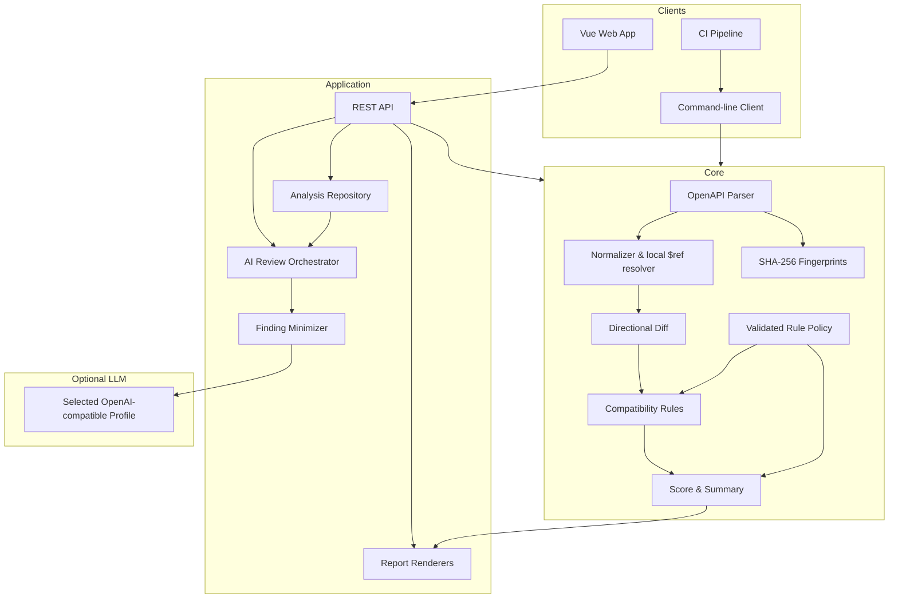
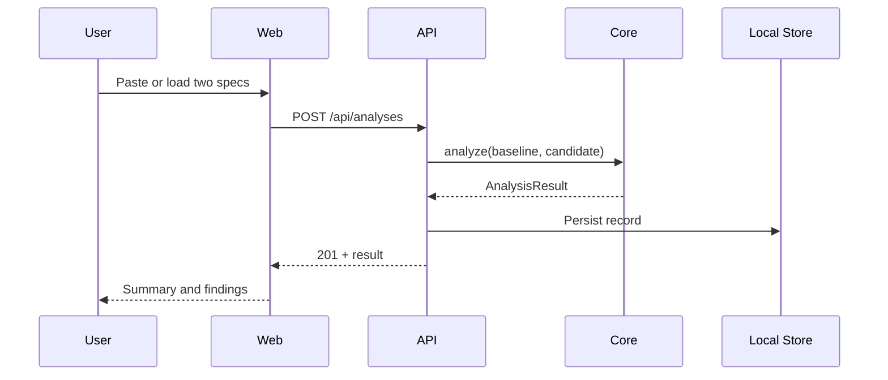
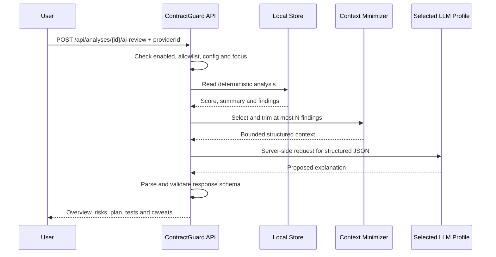

# 系统架构 / Architecture

## 1. 设计目标

ContractGuard 的架构围绕四个目标展开：

1. **一致性：** Web、REST API 与 CLI 使用同一个核心引擎，避免不同入口得出不同结论。
2. **可解释：** 分析结果必须能定位到规则和契约位置，并在适用时给出前后值。
3. **本地优先：** 确定性分析、报告和 CI 无需云服务；云端 AI 是默认关闭的可选解释层。
4. **可替换：** UI、存储、报告与 AI provider 围绕稳定的分析结果模型组合，可以独立扩展。

## 2. 逻辑架构



核心包是无 UI、无网络、无数据库依赖的 TypeScript 模块。API 负责编排分析、校验请求、保存历史和生成下载响应；Web 只消费 API，不复制规则判断；CLI 可以直接调用核心包，因此即使没有启动服务器，也能在 CI 中运行。AI 编排器只读取已经完成的确定性结果，不能回写 `Change`、分数或兼容结论。

## 3. 工作区组成

| 目录 | 职责 | 主要边界 |
| --- | --- | --- |
| `packages/core` | 解析、标准化、差异检测、规则、计分、公共类型 | 不读写数据库，不依赖 Web 框架 |
| `apps/api` | HTTP 接口、输入限制、历史存储、报告导出 | 不重新实现规则 |
| `apps/web` | Vue 单页应用、编辑/导入、筛选、历史与导出 | 不直接访问本地文件系统 |
| `apps/cli` | 文件读取、终端输出、退出码 | 复用 `core` 的结果模型 |
| `fixtures` | 可复现的输入契约 | 不作为生产规范 |
| `config` | LLM Profile 与规则策略 Schema/样例 | 真实 key 不进入 JSON |
| `docs` | 使用、设计、规则与评估文档 | 与实际版本同步维护 |

多 LLM 适配与 AI HTTP 路由属于 API 边界，而不是 `packages/core`。这能保证核心包在离线环境、测试和 CLI 中没有隐式网络行为。规则策略的严格校验、应用和指纹则属于核心包，使 API 与 CLI 使用同一治理口径。

## 4. 核心数据流

### 4.1 输入

基线与候选输入可以是 YAML 文本、JSON 文本或已解析对象。解析阶段首先为输入计算 SHA-256 指纹，再检查顶层结构和 `openapi` 版本字段，并对无法解析的内容返回结构化错误。文本按输入字节、对象按稳定规范化 JSON 计算，文件扩展名不是可信依据。

### 4.2 标准化

OpenAPI 允许参数出现在 path 和 operation 两层，也允许大量 `$ref`。标准化层负责合并继承关系、统一缺省值并解析文档内部的 `#/...` 引用，使规则不必重复处理语法差异。

标准化必须保留“这是请求还是响应”的上下文，因为兼容方向不同：

```text
request:  old accepted values ⊆ new accepted values  通常才是向后兼容
response: new produced values ⊆ old understood values 通常才是向后兼容
```

### 4.3 差异与规则

差异层按 `path + HTTP method` 匹配操作，再比较参数、请求体、响应和 schema。规则层把结构差异转成领域结论。每个 `Change` 包含：

```ts
type Severity =
  | 'breaking'
  | 'potentially-breaking'
  | 'non-breaking'
  | 'info';

interface Change {
  id: string;
  ruleId: string;
  severity: Severity;
  category: string;
  location: string;
  message: string;
  before?: unknown;
  after?: unknown;
  recommendation?: string;
}
```

结果中的 `id` 用于一次分析内稳定定位，`ruleId` 表示可版本化的判定类型。具体规则见 [compatibility-rules.md](./compatibility-rules.md)。

### 4.4 汇总与计分

`AnalysisResult` 保存来源元数据、引擎版本、生成时间、分类计数、变化列表、兼容结论与 0–100 的展示分。当前权重为每条 breaking 扣 12 分、每条 potentially-breaking 扣 4 分，最低为 0；分数不替代明细。`compatible` 只表示没有发现明确的 breaking 变化，与分数阈值无关。

为了可复现，计分不包含随机因素或远程模型调用。更改权重时必须提升规则/引擎版本，并在评估记录中说明。AI 响应中的 `riskLevel` 或 `priority` 是表达层信息，不能参与此处计算。

## 5. REST API 与 Web

默认开发拓扑：Web 开发服务器运行在 `5173`，API 运行在 `8080`。生产构建中，API 进程同时托管编译后的 Web 静态资源；Docker Compose 因而只暴露 `8080`。后续也可以把二者放在反向代理后的独立服务。浏览器只向 API 发送契约文本；当前实现没有账号体系或多租户权限模型，因此不应直接暴露到不可信公网。

一次 Web 分析流程如下：



### 5.1 可选 AI 解读流程

AI 调用与创建分析是两个独立动作。只有客户端对一个已存在的分析显式调用 `POST /api/analyses/{id}/ai-review` 时，API 才会访问用户选择的服务端 LLM 档案：



关键约束如下：

- 不发送原始 baseline/candidate OpenAPI，只发送摘要和有数量上限的结构化 finding；
- `secretEnv` 引用的 API key 只存在于服务端环境，浏览器请求和响应均不包含它；
- 浏览器只能从服务端返回的档案 ID 中选择，不能提供任意 URL、模型或凭据；
- 返回内容通过本地结构校验，无法解析或字段不合法时按上游错误处理；
- `promptVersion` 与 provider/model 元数据随响应返回，便于审计；
- 上游超时、错误或功能关闭只让 AI 请求失败，核心分析和 CI 继续可用。

## 6. 本地持久化

历史记录使用可配置数据目录中的 JSON 文件，适合单机演示和低并发个人使用。写入策略应遵循“写临时文件，再原子替换目标”的方式，减少进程中断造成的半文件风险。记录不应依赖输入文件的原始路径。

选择文件存储而不是关系数据库，是为了降低演示部署成本，并不表示它适合高并发生产环境。若要多人共享，建议用 repository 接口替换为 SQLite/PostgreSQL，并增加迁移、锁、备份与访问控制。

## 7. 报告渲染

渲染器从同一 `AnalysisResult` 生成：

- **JSON：** 保留完整结构，适合机器消费与二次分析；
- **Markdown：** 适合 pull request、课程报告与版本库归档；
- **HTML：** 自包含、便于离线打开和分享；
- **Table：** 由 CLI 在终端中提供紧凑摘要。

报告内容必须对用户提供的字段做转义，尤其是 HTML，以避免把规范描述中的标签当作可执行内容。

## 8. 安全与信任边界

OpenAPI 文件是**不可信输入**。实现与部署应考虑：

- 限制请求体和上传文件大小，避免内存耗尽；
- 限制引用深度并检测循环引用；
- 默认不抓取外部 `$ref`，避免 SSRF、隐私泄漏和不可复现结果；
- HTML 报告转义用户内容；
- 数据目录不可与静态站点根目录混用；
- 错误响应不泄漏绝对路径、堆栈或契约中的敏感值；
- 本地启动默认只绑定 `127.0.0.1`，开发 CORS 仅允许显式的 localhost 来源；
- 若部署到网络环境，应增加鉴权、TLS、速率限制、审计与保留策略。
- 发送给所选 LLM 的 finding 可能含内部端点名称，启用前必须按该档案的数据边界做分级、脱敏和合规评估；
- AI 输出是不可信文本，不能直接执行代码、修改规范或触发部署；
- 付费 AI 路由必须实施身份认证、每用户限流、预算告警和出口控制，防止 key 被间接滥用。

ContractGuard 的演示配置适合本机和受信任内网，不能直接视为互联网级 SaaS 安全基线。尤其是当前版本没有内置身份认证；Compose 因此默认只发布到宿主机 `127.0.0.1:8080`。公网部署必须置于带鉴权、TLS 和限流的反向代理之后。

## 9. 故障行为

| 故障 | 期望行为 |
| --- | --- |
| YAML/JSON 无法解析 | 返回可读的 4xx 错误，不创建历史记录 |
| 缺少 OpenAPI 版本 | 拒绝分析并指出缺失字段 |
| 不支持的版本 | 明确列出支持范围，而不是静默降级 |
| 无法解析的本地 `$ref` | 给出引用位置；不得把未解析节点误判为兼容 |
| 数据目录不可写 | 分析可失败为 5xx，并记录服务端诊断信息 |
| 单条报告导出不存在 | 返回 404 |
| 规则无法确定风险 | 使用 `potentially-breaking` 或跳过并注明覆盖限制 |
| AI 未启用或缺少 key | AI 路由返回 503；不影响确定性分析 |
| 所选 LLM 超时 | AI 路由返回 504；保留原分析并允许稍后重试 |
| 所选 LLM 拒绝或服务异常 | AI 路由返回 502；不把上游正文或 key 泄露给客户端，也不自动跨 Provider fallback |
| 模型返回非法结构 | 本地验证失败并返回 502，不能把未验证文本伪装成成功响应 |

## 10. 关键架构决策

### ADR-001：单一 TypeScript 引擎

共享类型和规则实现减少 Web/API/CLI 之间的语义漂移，也降低维护和排查成本。代价是所有运行入口需要兼容 Node/TypeScript 工具链。

### ADR-002：确定性裁决与生成式解释分离

API 兼容判定需要可复现和可审计，因此应用规则策略后的确定性引擎是严重等级、得分与 CI 的唯一来源。LLM 只对已经产生的 finding 做自然语言解释，并通过独立、显式调用触发。这样既能提供迁移叙事，也不会让随机输出进入发布门禁。

### ADR-003：本地文件存储

零配置和便携性优先于并发能力。通过 repository 边界保留替换空间。

### ADR-004：保守处理不确定语义

对组合 schema 或业务约束，宁可明确表示“潜在风险/暂不覆盖”，也不制造确定性。该原则决定了规则引擎的可信上限。

## 11. 演进路线

1. 扩充 OpenAPI 3.1 JSON Schema 关键字和组合 schema 规则；
2. 增加外部引用打包，但默认禁用远程获取并提供域名白名单；
3. 把规则集、严重等级映射和抑制项配置化；
4. 接入 Git 提交范围与 PR 评论；
5. 以标注基准集发布每个版本的覆盖率、precision/recall 与已知失败案例；
6. 在真实多人场景中替换持久化与身份认证层；
7. 在统一 provider 接口下增加经批准的本地模型，并用固定评测集比较解释质量、延迟和成本。
