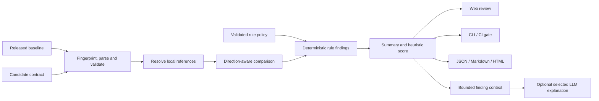

# ContractGuard：项目介绍与实际使用场景

> **English title:** ContractGuard — An Explainable OpenAPI Compatibility Analysis Platform
>
> **产品定位：** 面向 API 设计评审和持续集成的本地优先契约变更检查工具，提供可审计规则策略、输入指纹，以及与确定性判定隔离的可选多 LLM 报告解释器。

## 1. 一句话说明

ContractGuard 比较“当前已发布的 OpenAPI 契约”和“准备发布的新契约”，在代码合并或上线前找出可能破坏旧客户端的结构性变化，并给出可定位、可复核、可自动拦截的分析结果。

这里的重点不是判断两个文件是否相同，而是判断 **baseline 所允许的既有交互，在 candidate 上是否仍然成立**。

## 2. 它解决的真实问题

在前后端分离、移动端多版本并存或微服务协作中，API 提供方通常无法同时升级全部调用方。一个看起来很小的契约改动可能造成真实故障：

- 后端把 `limit` 从可选参数改为必填，尚未升级的客户端开始收到 `400`；
- 响应删除 `name`，前端仍然读取该字段；
- 请求枚举从 `[draft, active]` 收窄为 `[active]`，历史调用变得非法；
- 响应枚举加入新值，生成的 SDK 或穷举分支无法处理；
- 接口新增 API Key 要求，已有自动化任务没有凭据；
- `operationId` 被修改，重新生成 SDK 后方法名发生变化。

这些问题很难仅靠现有手段处理：

| 常见手段 | 能回答什么 | 留下的缺口 |
| --- | --- | --- |
| OpenAPI 语法校验 | 单份文档是否合法 | 两份合法文档之间仍可能不兼容 |
| Git 文本 diff | 哪些文本行被修改 | 无法理解请求/响应方向和引用关系 |
| 服务端单元测试 | 新实现是否符合当前预期 | 通常没有覆盖仍在使用旧契约的消费者 |
| 人工评审 | 能结合业务上下文判断 | 容易漏项，难以形成稳定、可重复的门禁 |

ContractGuard 把这类经验判断转成确定性规则，并保留人工复核入口。它不是要替代评审，而是把评审者从“逐行寻找变化”推进到“核对已经定位的风险”。

## 3. 谁会使用

| 使用者 | 关心的问题 | ContractGuard 提供的结果 |
| --- | --- | --- |
| API 维护者 | 这次改动能否直接发布 | 风险等级、位置、前后证据、修复建议 |
| 前端/移动端/SDK 团队 | 哪些旧调用需要升级 | 按接口和规则定位的变更报告 |
| Reviewer / 架构师 | PR 是否需要版本化或迁移期 | CLI 门禁、Markdown/HTML 报告和规则说明 |
| QA / 测试工程师 | 回归测试应覆盖什么 | 高风险 finding 与可选 AI 测试建议 |
| 平台团队 | 如何把契约检查纳入流水线 | 稳定退出码、JSON 输出和 REST API |

## 4. 四个实际使用场景

### 场景 A：Pull request 兼容性门禁

团队把生产版本的契约保存为 `openapi/released.yaml`，把本次 PR 的生成结果保存为 `openapi/candidate.yaml`。CI 执行：

```bash
node apps/cli/dist/index.js compare openapi/released.yaml openapi/candidate.yaml --format markdown --output contractguard-report.md --fail-on breaking
```

如果检测到 `breaking` finding，命令返回退出码 `2`，工作流失败，同时上传 Markdown 报告。开发者可以据此选择：

1. 把新字段先设为可选；
2. 保留旧状态码或旧媒体类型一段迁移期；
3. 新增 `/v2` 路径，而不是原地替换；
4. 在明确接受风险后调整团队门禁策略。

仓库内的 [`examples/github-actions-contractguard.yml`](../examples/github-actions-contractguard.yml) 提供了可复制的工作流骨架。

### 场景 B：实现前的 API 设计评审

设计者还没有写业务代码时，就可以在 Web 工作台导入当前规范与提案规范。页面先给出总览，再允许按严重等级或关键词筛选，随后查看每条 finding 的规则、位置、前后值和建议。

这种用法把兼容性问题提前到设计阶段，修复成本通常低于上线前或事故后修改。分析结果保存在本地 JSON 文件中，后续可以从“分析历史”重新打开，也可以导出 JSON、Markdown 或 HTML。

### 场景 C：客户端迁移与跨团队沟通

当 breaking change 确实无法避免时，规则报告负责提供事实依据；可选的多 LLM 解释器可以从管理员批准的 DeepSeek、OpenAI、Gemini、Ollama 或其他 OpenAI-compatible 档案中选择，把多个 finding 整理成：

- 面向评审者的风险摘要；
- 按优先级排列的关键影响；
- 分阶段迁移步骤；
- 与 finding ID 关联的测试建议；
- 对模型结论的 caveat。

AI 输出适合作为沟通草稿，不是新的判定来源。客户端负责人仍应回到原始 finding 核对证据，并结合客户端版本分布、真实流量和发布时间表做决定。

### 场景 D：本地审计、教学与复现实验

ContractGuard 不依赖数据库或云端分析服务。研究者或学生可以使用 fixture 重放固定变更，查看方向性规则如何工作，并通过测试与评估清单复核结果。V1.1 还在结果中记录 baseline、candidate 和规范化策略的 SHA-256，使同一输入与治理口径可以被复核；规则策略可在不修改源码的前提下启停、重分类规则和调整评分权重。

## 5. 一次完整分析如何发生



1. 解析 YAML/JSON，并确认输入属于支持的 OpenAPI 3.0/3.1 系列；
2. 解析同一文档内的 JSON Pointer `$ref`；
3. 计算输入与规范化规则策略的 SHA-256 审计指纹；
4. 按 path、HTTP operation、参数、request body、response、schema 与 security 等维度比较；
5. 应用规则启停和 severity 覆盖，产生 `breaking`、`potentially-breaking`、`non-breaking` 或 `info` finding；
6. 使用策略评分权重汇总数量并计算启发式分数；
7. 通过 Web、CLI、REST API 或导出报告消费同一份结果；
8. 只有用户主动生成 AI 解读时，服务端才会发送裁剪后的 finding 上下文。

同样的核心引擎由 Web、API 和 CLI 复用，避免不同入口给出不同兼容性口径。

## 6. 可复现示例

仓库包含三份演示规范：

- `fixtures/petstore-v1.yaml`：已发布基线；
- `fixtures/petstore-v2-breaking.yaml`：包含端点删除、必填参数、请求枚举收窄、响应类型变化、媒体类型删除和鉴权增强等变化；
- `fixtures/petstore-v2-compatible.yaml`：以新增可选能力和放宽请求约束为主。

安装并构建后运行：

```bash
pnpm contractguard compare fixtures/petstore-v1.yaml fixtures/petstore-v2-breaking.yaml --format markdown --output contractguard-report.md --fail-on never
```

使用 `--fail-on never` 可以始终生成报告；在 CI 中改为 `--fail-on breaking` 即可启用发布门禁。完整启动步骤见 [用户指南](./user-guide.md)，规则语义见 [兼容性规则](./compatibility-rules.md)。

Web 工作台还内置一组 Campus Events API 演示数据。它与 `fixtures/` 中用于自动化回归的 Petstore 文件是两套不同示例，不应把界面演示名称与测试 fixture 混用。

## 7. 为什么 AI 不直接判断兼容性

兼容性门禁需要稳定、可追踪、能够在 CI 中重复执行。让大模型直接决定“是否允许发布”会带来输出漂移、证据难复核和外部服务不可用等问题。因此本项目采用两层设计：

| 层 | 负责 | 不负责 |
| --- | --- | --- |
| 确定性规则引擎 + 已验证策略 | finding、severity、score、`compatible`、CI 退出码和指纹 | 自然语言汇总和受众化表达 |
| 可选 LLM 解释层 | 摘要、关键风险、迁移步骤、测试建议 | 改写规则结果或改变门禁结论 |

默认情况下，AI 请求不包含原始 OpenAPI，也不包含完整 `before`/`after` 对象；只发送数量与字段长度受限的 finding 摘要。由于摘要仍可能包含内部接口名称，使用者仍需执行数据分级、脱敏和费用评估。具体配置见 [AI 报告解释器](./ai-report-interpreter.md)。

## 8. 功能边界

当前版本有意把可信范围限定在可以解释和测试的部分：

- 支持 OpenAPI 3.0/3.1，不承诺 Swagger 2.0；
- 重点处理 HTTP 请求与响应契约，不理解业务含义、数据库迁移或运行时副作用；
- 支持同一文档内的 JSON Pointer `$ref`，不获取外部 URL 或跨文件引用；
- `oneOf`、`anyOf`、`allOf`、discriminator、callbacks、links 等高级语义只做部分检查或暂不判断；
- 兼容性分数用于排序和沟通，不是故障概率或生产安全证明；
- 本地服务没有内置账号、租户隔离、TLS、限流和 AI 预算控制，不能直接暴露到公网；
- 工具不能替代消费者契约测试、集成测试、灰度发布和人工设计评审。

对于仅凭 OpenAPI 无法确定的影响，系统倾向于产生 `potentially-breaking` 或明确不覆盖，而不是伪造精确结论。

## 9. 工程与研究价值

这个项目覆盖了一个完整而可检验的软件工程闭环：

- **领域建模：** 把请求/响应方向、集合包含关系和风险等级转成显式规则；
- **全栈一致性：** Web、REST API 和 CLI 复用同一 TypeScript 核心；
- **工程交付：** 包含文件持久化、报告导出、Docker、Windows 启动和 GitHub Actions；
- **可解释性：** 每条结论包含规则 ID、位置与适用证据，不依赖黑盒总分；
- **治理与审计：** 规则策略可配置且严格校验，结果记录输入和策略指纹；
- **可信 AI：** 生成式模型只做受约束的解释，不进入确定性决策路径；
- **验证意识：** 使用单元测试、fixture、manifest 冒烟测试和公开评估方法区分“已经验证”与“尚未证明”。

### 用于申请或作品集时如何介绍

建议把重点放在问题建模与工程取舍，而不是把它描述成“AI 自动检测一切”。一个准确的简短表述是：

> 设计并实现了一个 OpenAPI 向后兼容性分析平台，将请求/响应方向相关的契约变化建模为可解释规则，以策略 JSON 和 SHA-256 指纹支持可审计治理，并以同一核心支持 Web、REST API 与 CI CLI；进一步加入可切换的多 LLM 解释层，通过服务端 allowlist、结构校验和最小化上下文控制生成式输出风险。

展示时可以按“真实故障场景 → 方向性规则 → 统一架构 → CI 门禁 → 可信 AI 边界 → 可复现验证”的顺序演示。应避免声称“覆盖全部 OpenAPI”“已经证明生产安全”或“达到某个准确率”，除非对应数据集、实验记录和失败案例已经公开。

## 10. 评估口径

当前 bundled fixtures 能证明主要链路可以重复运行，并能防止若干关键规则回归；它们不能单独证明工具在所有真实项目上的 precision、recall 或性能。完整评估需要：

1. 为每条规则准备原子正例、反例和不确定边界；
2. 分别覆盖 request/response、内联 schema 与本地 `$ref`；
3. 使用不依赖工具输出的人工标签；
4. 同时报告误报、漏报、混淆矩阵与已知失败案例；
5. 固定版本、输入和运行环境，保存原始产物。

具体方法和已记录结果见 [评估方案](./evaluation.md)与[验证记录](./verification.md)。

## 11. 可继续扩展的方向

- 生成 GitHub/GitLab pull request 注释与状态检查；
- 支持组织级规则配置、抑制项和已接受基线；
- 在禁用远程获取的默认前提下增加受控的跨文件引用打包；
- 利用消费者 SDK、流量样本或契约测试降低误报；
- 扩展 OpenAPI 3.1 JSON Schema 与组合 schema 推理；
- 增加 AsyncAPI、GraphQL schema 或 protobuf/gRPC 兼容性分析；
- 扩充公开标注集，按规则类别报告 precision、recall 与性能。

## 12. 规范与责任说明

OpenAPI 的权威定义请参考 [OpenAPI Specification](https://spec.openapis.org/oas/)，包括 [3.0.4](https://spec.openapis.org/oas/v3.0.4.html)和 [3.1.2](https://spec.openapis.org/oas/v3.1.2.html)。ContractGuard 的规则是面向提供方升级的兼容性策略，不是 OpenAPI 标准的一部分。

ContractGuard 不对任何 API 的生产安全、法律合规或零停机升级作保证。最终发布决策仍应结合客户端版本分布、服务等级、真实流量、集成测试与组织变更流程。
