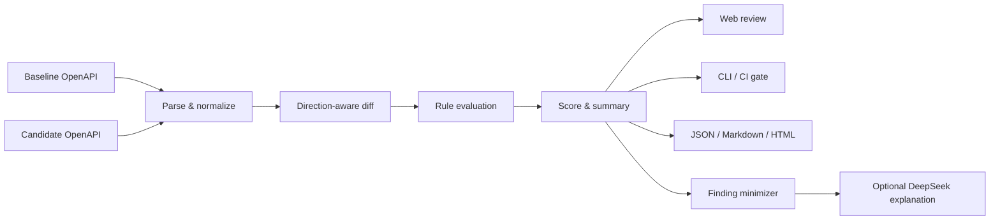

# ContractGuard：API 兼容性分析平台

> **English title:** ContractGuard — An Explainable OpenAPI Compatibility Analysis Platform
>
> **定位：** 面向 API 设计评审与持续集成的本地优先、可解释、可复现契约变更检查工具，并提供可选的 DeepSeek 云端报告解释器。

## 项目摘要

在多人协作的软件系统中，API 文档的改动很容易在没有修改 URL 的情况下破坏调用方：例如新增必填字段、收窄枚举、删除成功响应状态码，或给既有接口增加鉴权要求。人工评审既耗时，也常常忽略这种“语义层”的不兼容。

ContractGuard 接收两个 OpenAPI 3.0 或 3.1 文档（baseline 与 candidate；参见 [OpenAPI 3.0.4 官方规范](https://spec.openapis.org/oas/v3.0.4.html)、[OpenAPI 3.1.2 官方规范](https://spec.openapis.org/oas/v3.1.2.html)及[官方版本索引](https://spec.openapis.org/oas/)），将其解析为统一结构，再按请求方与响应方的不同兼容方向执行确定性规则，输出：

- 可追踪到具体路径和字段的变更清单；
- `breaking`、`potentially-breaking`、`non-breaking`、`info` 四级风险；
- 兼容性得分与分级汇总；
- JSON、Markdown、HTML 等适合机器或人员阅读的报告；
- 可用于 CI 的命令行退出码，以及可本地演示的 Web 管理界面；
- 可选的 DeepSeek AI 解读，将确定性 finding 组织为摘要、关键风险、迁移计划和测试建议。

核心分析不依赖付费模型。除时间戳与持久化记录 ID 外，相同输入会产生相同的语义结果；每条结论都有规则编号和位置，适用的规则还会附带前后值与修复建议，便于复核。DeepSeek 仅作为显式启用的解释层，不能改写严重等级、得分、兼容结论或 CI 退出码；模型不可用时，确定性分析仍可完整运行。

## English abstract

ContractGuard is a local-first and explainable compatibility checker for OpenAPI contracts. It compares a baseline specification with a candidate version, applies direction-aware rules to request and response schemas, and produces reviewable findings with stable identifiers, severity, locations, and—where applicable—before/after evidence and remediation hints. The same engine powers a REST API, a browser-based dashboard, and a CI-friendly CLI. An optional DeepSeek report interpreter turns those findings into audience-friendly explanations and migration guidance, while deterministic results remain the sole authority for scoring and CI decisions.

## 为什么值得做

### 真实问题

API 兼容性并不等于文本差异。对请求参数来说，“允许更多输入”通常更兼容；对响应枚举来说，“返回更多可能值”却可能使使用穷举分支的旧客户端失效。同一个 schema 变化必须结合它出现的位置判断，单纯比较 JSON 节点无法给出可靠结论。

### 工程价值

ContractGuard 将这个问题拆成可测试的层次：解析与校验、引用解析、端点匹配、方向感知的规则、风险汇总、持久化、报告和交互界面。它可以作为 pull request 的质量门禁，也可以在设计评审时直接运行。

### 工程与研究价值

该项目把一个容易停留在经验判断层面的兼容性问题，转化为可以实现、测试和复核的工程系统，重点体现：

- 对 API 契约、向后兼容与软件演化的理解；
- 将领域规则抽象为可扩展引擎的能力；
- 全栈交付、CLI、REST API、持久化和报告导出的工程完整性；
- 将可复现规则引擎与受约束的大模型解释层分离的可信 AI 架构能力；
- 用带标签样例、单元测试和可复现实验评估工具有效性的研究意识；
- 对适用边界和误报/漏报风险的诚实说明。

公开的验证结果只陈述已经运行和复核过的内容。没有完成对应实验时，不报告具体准确率，也不宣称覆盖全部 OpenAPI 语义。

## 功能全景

| 能力 | 说明 |
| --- | --- |
| Web 工作台 | 粘贴或导入基线/候选规范，运行分析，按风险和关键词筛选结果 |
| 规则引擎 | 识别路径、操作、参数、请求体、响应、schema、鉴权及元数据变化 |
| REST API | 创建、读取、删除分析记录，读取规则目录，导出报告 |
| CLI | 在本地或 CI 中比较两个文件，并按风险阈值返回退出码 |
| 报告导出 | JSON 便于自动化；Markdown/HTML 便于评审和归档 |
| 历史记录 | 使用本地文件持久化近期分析，无需外部数据库 |
| AI 报告解释器 | 可选调用 DeepSeek，把裁剪后的 finding 转为摘要、迁移计划和测试建议 |
| 演示样例 | 同时提供兼容与不兼容的 Petstore 契约，便于快速验证 |
| 自动化测试 | 覆盖解析、规则、API 与前端数据处理行为，并支持可复现实验 |

## 一次分析如何发生



典型流程是：选择两个 YAML/JSON 文件，执行分析，先查看摘要，再定位高风险条目。每条结果显示类似 `/pets > GET > parameters.query.limit` 的位置，并说明“为什么属于破坏性变化”和“可以如何兼容迁移”。如启用 AI，可在分析完成后另行请求一份面向人员的解读；这条支路不会回写或覆盖规则结果。

## 快速演示

项目自带三个规范：

- `fixtures/petstore-v1.yaml`：基线；
- `fixtures/petstore-v2-breaking.yaml`：包含删除端点、增加必填参数、收窄请求枚举、修改响应类型、增加鉴权等变化；
- `fixtures/petstore-v2-compatible.yaml`：以新增可选参数、新增操作和新增可选字段为主。

安装依赖并构建后，可以用 CLI 运行：

```bash
pnpm contractguard compare fixtures/petstore-v1.yaml fixtures/petstore-v2-breaking.yaml --format markdown --output contractguard-report.md --fail-on breaking
```

完整的本地启动方法见 [用户指南](./user-guide.md)，系统设计见 [架构说明](./architecture.md)，判定口径见 [兼容性规则](./compatibility-rules.md)。

若要体验 DeepSeek 云端解释功能，请继续阅读 [AI 报告解释器完整教程](./ai-report-interpreter.md)。该功能默认关闭，需要用户自己的 DeepSeek API key，并可能产生云端费用。

仓库源码、文档、样例、测试与发布边界的完整状态见 [交付清单](./delivery-checklist.md)。

## 结果应如何解读

兼容性得分用于排序和沟通，不是数学证明，也不是服务可用性的概率。真正影响发布决策的依据应是：高风险条目、组织对客户端的控制程度、实际流量、版本策略及集成测试结果。对于无法仅凭 OpenAPI 判断的变化，ContractGuard 会优先标记为 `potentially-breaking`，而不是给出过度确定的结论。AI 返回的总体风险和优先级同样只是解释性归纳，不是第二套判定引擎。

## 明确边界

当前版本有意限定范围：

- 目标是 OpenAPI 3.0/3.1 文档；不承诺完整支持 Swagger 2.0；
- 重点处理 HTTP 请求/响应契约，不理解业务含义、数据库迁移或运行时副作用；
- 能可靠处理本地组件引用；外部 URL、跨文件引用和复杂递归结构可能需要先打包（bundle）；
- `oneOf`、`anyOf`、`allOf`、discriminator、XML、callbacks、links 等高级语义仅部分覆盖或暂不判断；
- 服务器 URL 的修改会影响部署，但不属于核心 schema 规则，需结合环境配置评审；
- 工具不能替代消费者契约测试、集成测试、灰度发布和人工设计评审。
- AI 默认不会发送原始 OpenAPI，但裁剪后的 finding 仍可能包含内部接口名称；使用者需自行评估云端数据、隐私与费用。

这些限制不是附注，而是报告可信度的一部分。后续可以通过公开规则覆盖矩阵、带标签基准集和版本化规则集持续收窄盲区。

## 技术关键词

`TypeScript` · `OpenAPI 3.0/3.1` · `Vue 3` · `REST API` · `CLI` · `YAML/JSON` · `Vitest` · `Docker` · `CI quality gate` · `Explainable analysis` · `DeepSeek API` · `Structured AI output`

## 可继续扩展的方向

- GitHub/GitLab pull request 注释与状态检查；
- 远程 Git 仓库或制品库中的契约版本对比；
- 外部引用安全解析与文档打包；
- AsyncAPI、GraphQL schema、protobuf/gRPC 兼容性；
- 面向组织的规则配置、抑制清单和基线接受流程；
- 根据真实 SDK 和流量信息降低误报；
- 扩展人工标注数据集，报告各类规则的 precision、recall 与失败案例。

## 许可证与责任说明

ContractGuard 是工程分析工具，不对任何 API 的生产安全、法律合规或零停机升级作保证。使用者应根据服务等级、客户端版本分布和组织变更流程做最终发布决策。
